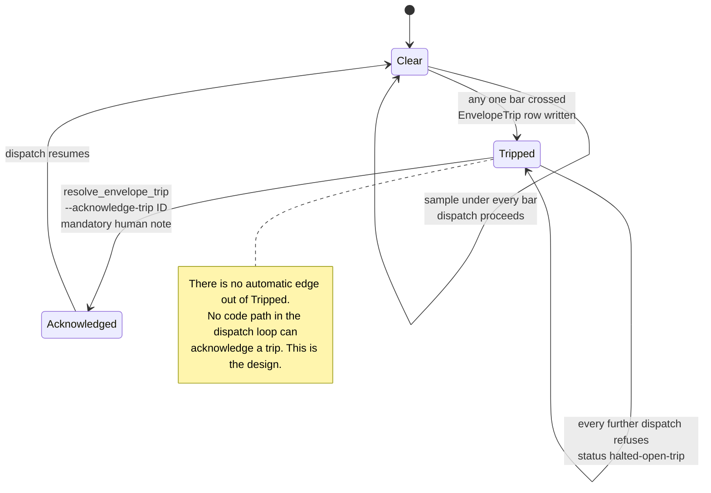

As of: 2026-07-25
What this is: the admin-facing operational truth for Stage E's envelope
enforcement primitive (Phase 1), streaming dispatch loop (Phase 2), and the
Phase 3 shakedown driver (issue #465), all implementing
[`docs/proposals/stage-e-streaming.md`](../proposals/stage-e-streaming.md)
(issue [#153](https://github.com/ProxyPrints/ProxyPrints.github.io/issues/153)).
That brief is the design authority (still **HOLD**, owner review pending on
§3-§5 as a whole) and is not restated here — this doc covers what an
operator actually does: the two operating modes, what the envelope bars
mean, the trip/resume runbook, the dispatch loop itself (its trigger,
batching, and observability), and the shakedown driver that routes the
Bug-A tail through that same dispatch loop. See
[`docs/theory.md`](../theory.md)'s new "Streaming and continuous operation"
section for why none of this changes the soundness model.

Phase 1 shipped the envelope PRIMITIVE (`cardpicker/operating_envelope.py`,
the `EnvelopeTrip` model, and the `resolve_envelope_trip` management command).
Phase 2 (this update) is the first CALLER of that primitive: the streaming
dispatch loop itself (`cardpicker/stage_e_dispatch.py`) — see "Phase 2 — the
streaming dispatch loop" below. **Both phases ship default-OFF**
(`settings.STAGE_E_STREAMING_ENABLED = False`) — turning streaming on against
production is the phase-3 shakedown's own polled owner action, not something
either phase does by merging.

---

## The two operating modes

Stage E ratified a two-mode split (`stage-e-streaming.md` §10(a)) rather
than a single cards/hour ceiling:

- **PASSIVE mode** — continuous operation against submitted drives and
  newly-created cards (Phase 2's eventual event-driven trigger). Load-
  governed, not rate-governed: no cards/hour cap at all. This is the mode
  the envelope primitive on this page governs.
- **BULK mode** — backfill work, unchanged from today's discipline: polled
  per-batch at max throughput, gated by `pilot_run_lifecycle.py`'s forced
  dry-run-before-write check (issue #362/PR #373), one human poll per
  batch — exactly how every fire-sequence pass in
  [`docs/pipeline-fidelity-gate.md`](../pipeline-fidelity-gate.md) already
  ran. **`operating_envelope.py` does not apply to BULK mode at all** — a
  BULK invocation (`run_image_evidence_cohort`, `local_calculate_verdicts`,
  etc.) is governed by the existing dry-run-guard/ledger machinery those
  commands already have, not by this primitive.

If you're running a `--limit`/`--card-ids-file` batch command today, you are
in BULK mode and this page's envelope/trip mechanism does not gate you.
This page is entirely about the PASSIVE-mode mechanism a future streaming
daemon will use.

## The envelope model

A PASSIVE-mode dispatcher is expected to sample four live signals before
every micro-batch dispatch and refuse to dispatch (HALT) the instant any one
of them crosses its bar. The four ratified bars
(`stage-e-streaming.md` §10(a)), in the priority order
`operating_envelope._bar_breach` checks them:

| bar                  | ceiling                                 | source                                                                            |
| -------------------- | --------------------------------------- | --------------------------------------------------------------------------------- |
| Google fetch lockout | any occurrence — **instant** pause      | the existing `GoogleFetchLockoutError`/`lockout_hit` signal, unchanged            |
| Host load average    | **> 7.0**                               | the existing escalation threshold (`docs/reports/2026-07-23-4c-pilot-dry-run.md`) |
| RSS per worker       | **> 512MB**                             | `stage-e-streaming.md` §10(a), a new, streaming-specific per-worker bar           |
| Fetch-failure rate   | **> 1%** over a rolling 500-card window | `stage-e-streaming.md` §10(a)                                                     |

None of these numbers are invented on this page or in `operating_envelope.py`
itself — every one is cited to the ratifying brief section in that module's
own docstring, which is the place to check if a bar's exact value is ever in
question.

**HALT is not a soft slowdown.** The moment any bar is breached, the
primitive persists an `EnvelopeTrip` row (`bar`, the observed `detail`
values, `tripped_at`, an optional `run_id`) and the dispatcher is expected
to stop issuing new micro-batches entirely — in-flight work already
dispatched is allowed to drain (matching the existing kill-test/resume-
contract's own "in-flight work drains, nothing new starts" discipline), but
no NEW batch goes out while a trip is open.

### FIG-4a — Trip lifecycle



### FIG-4b — Gate anatomy

A table, not a graph — five gates vary along five fixed attributes, which
a table renders directly and a graph would only obscure.

| Gate                   | What it measures                                                                                                                                                                                                                                                                                                                | Threshold                                                                                | On fire                                                                                                                                               | Resume                                           | Cost when it fires                                                                                                                                                                             |
| ---------------------- | ------------------------------------------------------------------------------------------------------------------------------------------------------------------------------------------------------------------------------------------------------------------------------------------------------------------------------- | ---------------------------------------------------------------------------------------- | ----------------------------------------------------------------------------------------------------------------------------------------------------- | ------------------------------------------------ | ---------------------------------------------------------------------------------------------------------------------------------------------------------------------------------------------- |
| **Host load**          | 1-minute load average, sampled fresh before every dispatch                                                                                                                                                                                                                                                                      | `> 7.0` — the box has 8 OCPU with 1 pinned to networking, so 7.0 _is_ the 7 usable cores | Writes an `EnvelopeTrip`, returns `halted-new-trip`; all dispatch stops                                                                               | Human `--acknowledge-trip` with a mandatory note | Total pipeline stop until a human returns. Both live trips were this bar                                                                                                                       |
| **RSS per worker**     | Resident memory of the dispatching worker process                                                                                                                                                                                                                                                                               | `> 512 MB`                                                                               | Same — trip, halt                                                                                                                                     | Same                                             | Total stop. Never fired live                                                                                                                                                                   |
| **Fetch-failure rate** | Failures over a rolling 500-outcome window, per worker process                                                                                                                                                                                                                                                                  | `> 1%`, and never on an empty window                                                     | Same — trip, halt                                                                                                                                     | Same                                             | Total stop. Never fired live                                                                                                                                                                   |
| **Google lockout**     | Any `GoogleFetchLockoutError`                                                                                                                                                                                                                                                                                                   | None — any single occurrence trips instantly                                             | Stage C stops mid-batch; in-flight work drains, nothing new starts                                                                                    | Same                                             | Total stop. Never fired live                                                                                                                                                                   |
| **Concurrency cap**    | Dispatches running at once, across every django-q2 worker process, via a Postgres advisory lock held on a **dedicated** connection (2026-07-25 fix, PR #453 — never Django's own shared `django.db.connection`, which a same-process `django_q` broker enqueue call could silently close mid-dispatch, auto-releasing the lock) | `2` slots, floored at 1 if misconfigured                                                 | Returns `throttled-concurrency-cap` and does nothing — **no trip, no ledger row**, but does advance the `StageEThrottleCounter` observability counter | **Automatic** — the next sweep picks the card up | One deferred micro-batch. Did not bind on either live shakedown run (see FIG-3a below) — root-caused and fixed 2026-07-25 (PR #453); see "Concurrency cap" below for the full incident writeup |

The cap is the only one of the five that is proactive rather than
reactive, and the only one that recovers without a human. The other four
are the same mechanism with different sensors: measure, cross, stop, wait
for a person.

## Resume requires a fresh owner action — always

**There is no self-resume, in any case, for any bar.** This is a hard
ratified rule (`stage-e-streaming.md` §3 decision (5)/§10(a)), not a default
that happens to be conservative — matching the same posture PR #373's
`--skip-dryrun-check` already established elsewhere in this pipeline: an
override is allowed, but it is always explicit and always logged, never
automatic. A PASSIVE-mode dispatcher must never clear its own trip, no
matter how quickly the underlying condition (load, RSS, failure rate)
recovers.

### Runbook: investigating and clearing a trip

1. **Find the open trip.** Either from the streaming daemon's own halt
   message (once Phase 2 exists), or directly:
   ```python
   from cardpicker.operating_envelope import current_trip
   current_trip()  # None if nothing is open
   ```
   or via the Django admin (`EnvelopeTrip` is registered, read-only —
   `trip_id`/`bar`/`run_id`/`tripped_at`/`acknowledged_at` are all listed
   and searchable there; the admin form cannot itself acknowledge a trip —
   see "Why the admin can't resume a trip" below).
2. **Understand why it tripped.** `EnvelopeTrip.detail` carries the exact
   observed values against the ceiling (e.g.
   `{"load_avg": 8.2, "ceiling": 7.0}`) — this is the whole investigation
   payload; there is nothing else to correlate for a single trip beyond
   whatever host-level diagnosis (`top`, `docker stats`, the fetch-failure
   log) the bar itself suggests.
3. **Fix or confirm the underlying condition**, exactly as you would for any
   of the pre-existing "note-prominently"/kill RSS bars or the 7.0 load
   escalation threshold this reuses — nothing about diagnosis changes just
   because the signal now also persists a trip row.
4. **Acknowledge the trip**, once you're satisfied it's safe to resume:
   ```bash
   docker compose -f docker-compose.prod.yml run --rm django \
     python manage.py resolve_envelope_trip \
     --acknowledge-trip <trip-id> \
     --note "host load confirmed back under 3.0, checked via top"
   ```
   `--note` is mandatory and non-empty — an acknowledgement always carries a
   human-readable reason, durably, on the trip row itself (not just in a
   terminal that may never be read again). A trip that's already
   acknowledged, or a `trip_id` that doesn't exist, raises a `CommandError`
   rather than silently doing nothing.
5. **Nothing dispatches automatically on acknowledgement.** Clearing a trip
   only removes it from `current_trip()`'s result — a Phase 2 dispatcher's
   own poll loop is what actually resumes issuing micro-batches, the next
   time it checks and finds the envelope clear.

### Why the admin can't resume a trip

`EnvelopeTrip`'s Django admin registration is entirely read-only (every
field, including `acknowledged_at`/`acknowledged_note`) — `resolve_envelope_trip`
is the ONLY code path permitted to set those fields
(`operating_envelope.acknowledge_trip`'s own docstring). This is deliberate,
not an oversight: the admin is a monitoring surface for finding a `trip_id`
to hand to the command, not a second, less-visible resume path that could
bypass the mandatory `--note` and the CLI's own audit trail.

### FIG-3a — Shakedown timeline (dated snapshot, read 2026-07-25T01:18:57Z)

A worked example of the runbook above, against the pipeline's first two
live PASSIVE-mode shakedown runs. This is a **dated snapshot, not a live
readout** — written as a two-incident post-mortem so it stays true after
the second trip below is eventually cleared, not as a "current state"
claim that goes stale the moment someone runs `resolve_envelope_trip`.

```mermaid
timeline
    title Stage E shakedown · host load against a 7.0 ceiling on 7 usable cores
    section Run 1 — 2026-07-24
        21:44:47Z : Backstop sweep opens the first dispatch
        21:44:50Z : 9 dispatches now running concurrently on 7 cores
        21:44:50-56Z : 7 of 9 crash · IntegrityError on a duplicate vote
        21:46:16Z : TRIP envtrip-be6e5db9 · load 11.85 vs ceiling 7.0 · ALL DISPATCH HALTS
    section Between the runs
        Vote collision fixed : skip-if-exists guard plus ignore_conflicts
        Concurrency cap added : 2 slots via Postgres advisory locks
    section Run 2 — 2026-07-25
        00:22:13Z : Owner acknowledges trip 1 · dispatch resumes
        00:23:23-37Z : 9 dispatches · ALL 9 COMPLETE · the collision fix held
        00:23-25Z : Cap does NOT bind · 8 unlock warnings · 0 throttles
        00:25:04Z : TRIP envtrip-73e1eb6d · load 11.40 vs ceiling 7.0 · STILL OPEN
```

**Reading it:** one bug was fixed and one was revealed. The vote collision
is gone — run 2 wrote nine clean ledger rows where run 1 lost seven. The
concurrency cap that was supposed to prevent the load spike never engaged:
Postgres reported the advisory lock was already released by the time each
dispatch tried to unlock it, so every dispatch believed it had a free slot
and zero were ever throttled. Load reached 11.40 against a 7.0 ceiling for
the second time, and the envelope caught it for the second time.

**State as of the stamp above:** trip `envtrip-20260724T214616-be6e5db9`
(run 1) is **acknowledged**. Trip `envtrip-20260725T002504-73e1eb6d`
(run 2) remains **open** — its root cause (the advisory lock riding
Django's shared, same-thread connection, which a same-process `django_q`
enqueue call could silently close mid-dispatch) has since been found and
fixed (PR #453, see FIG-4b and "Concurrency cap" below for the mechanism),
but a fix does not self-clear a trip: per "Resume requires a fresh owner
action — always" above, only an explicit `resolve_envelope_trip --acknowledge-trip` against this specific trip ID resumes dispatch. This
line will go stale the moment that happens; the timeline above will not.

**Deliberately not committed here: the quantitative load-versus-ceiling
chart.** Mermaid has no primitive for a threshold line, a shaded
exceedance band, or a halted interval, so a faithful version of that chart
is hand-authored SVG, not mermaid — and isn't checked into `docs/` in this
pass (no asset-maintenance owner assigned yet, and the real
`STAGE_E_MICRO_BATCH_SIZE`/cap-tuning numbers this chart would anchor to
are still pending the phase-3 shakedown per "Micro-batch sizing" above).
The event timeline above carries the same facts in prose-adjacent form;
the chart can follow once there's real tuning data to plot against the
ceiling.

## Phase 2 — the streaming dispatch loop

Built 2026-07-24, per the owner-approved Phase 2 implementation task for
`stage-e-streaming.md` §3-§5 (still HOLD as a brief — this is the
owner-pre-approved implementation of what it already specced, the same
posture Phase 1 shipped under). Ships **default-OFF**
(`settings.STAGE_E_STREAMING_ENABLED = False`) — every mechanism below is
live code, wired unconditionally, but every entry point checks the flag
first and is a no-op while it's False. Flipping it to `True` is the ONLY
action the phase-3 shakedown needs to take to go live; no redeploy of this
code is required.

### What it is

`cardpicker/stage_e_dispatch.py`'s `dispatch_micro_batch` is the CONVEYOR —
the first real caller of Phase 1's `check_envelope`/`current_trip` primitive.
It is a DISPATCH LOOP only: it never reimplements Stage C extraction, Stage D
calculator decode logic, or consensus resolution — every actual accept/reject
decision still happens inside the same `cardpicker.image_evidence`/
`cardpicker.local_calculate_verdicts`/`cardpicker.printing_consensus` code
BULK mode already uses, called via their existing entry points. BULK-mode
commands (`run_image_evidence_cohort`, `local_calculate_verdicts`,
`reparse_collector_evidence`, `consensus_recompute`, etc.) are byte-identical
to before this change — none of their own call sites pass the new optional
`card_ids` scoping parameter `local_calculate_verdicts.py`'s three calculator
entry points (`run_join_key_calculator`/`run_fallback_calculator`/
`run_slow_path_calculator`) gained for this module's benefit.

### Ordering, every dispatch call

1. **Default-off gate** — `settings.STAGE_E_STREAMING_ENABLED` must be `True`,
   or the call is a no-op (`status="disabled"`).
2. **No-self-resume gate** — `operating_envelope.current_trip()` must be
   `None`, or the call refuses outright (`status="halted-open-trip"`) with
   zero DB writes beyond the lookup itself. This is the binding rule from
   Phase 1's own review: no code path in `stage_e_dispatch.py` ever calls
   `acknowledge_trip` — resume is always `resolve_envelope_trip`'s own
   command, a fresh, explicit owner action (see the runbook above).
3. **Fresh envelope sample** — live host load (`os.getloadavg()`), this
   worker process's own RSS (`cardpicker.process_metrics.get_process_rss_mb`),
   and a rolling fetch-outcome window feed `check_envelope`. If THIS sample
   breaches a bar, a new trip is recorded and the call halts
   (`status="halted-new-trip"`) before touching Stage C/D at all.
4. **Micro-batch selection** — `_select_micro_batch` builds the card-id list:
   the triggering event's own card first (if any), filled up to
   `settings.STAGE_E_MICRO_BATCH_SIZE` from the Stage C backlog (cards
   lacking a full-manifest `ImageEvidence` row — the same shape
   `run_image_evidence_cohort.py`'s own resume filter uses, imported, not
   reimplemented) via the persistent sweep cursor described below (issue
   [#458](https://github.com/ProxyPrints/ProxyPrints.github.io/issues/458)).
5. **Concurrency-cap slot acquire** (companion change, 2026-07-24 —
   `cardpicker.stage_e_concurrency`) — refuses PROACTIVELY
   (`status="throttled-concurrency-cap"`, zero DB writes beyond the
   advisory-lock check itself) once `settings.STAGE_E_MAX_CONCURRENT_DISPATCHES`
   (default 2) dispatches are already running concurrently, anywhere across
   this box's django-q2 worker processes. See "Concurrency cap" below for
   the full mechanism and the incident that motivated it — distinct from,
   and a proactive complement to, the envelope's own reactive host-load bar.
6. **Stage C** (sequential, per-card, not pooled — a micro-batch is far too
   small for BULK mode's process-pool concurrency to help) — the same
   `compute_card_evidence`/`persist_evidence` unit `run_image_evidence_cohort.py`
   drives, one card at a time. A `GoogleFetchLockoutError` stops Stage C for
   this batch immediately and records a fresh trip (instant-pause bar) —
   in-flight, already-committed work stays committed; Stage D below still
   runs against whatever was reached ("in-flight work drains, nothing NEW
   starts").
7. **Stage D** — `run_join_key_calculator`/`run_fallback_calculator`/
   `run_slow_path_calculator`, called AS-IS with the new `card_ids` scope, in
   the same escalation order every BULK-mode invocation already uses. Each of
   these already calls `resolve_and_persist_printing` internally for every
   card it touches — this is what satisfies §3 decision (4)'s "scoped
   incremental per-touch consensus recompute" with no separate consensus step
   in the dispatcher at all.
8. **Ledger write, then concurrency-cap slot release** — one `PilotRunLedger`
   row per micro-batch (see "Observability" below), then the slot acquired in
   step 5 is released (always, including on an exception - see "Concurrency
   cap" below).

### Trigger: event-driven, plus a cron backstop (§3 decision (1))

- **Event-driven** (`cardpicker/stage_e_signals.py`, wired in
  `cardpicker.apps.CardpickerConfig.ready()`): a `post_save` receiver on
  `Card` (only `created=True` — "card-create") and on `ImageEvidence` (every
  save — "evidence-change") queues `dispatch_for_card` via django-q2's
  `async_task`, never inline. Both receivers check
  `STAGE_E_STREAMING_ENABLED` before doing anything, including before
  importing `django_q.tasks` — connecting the receivers themselves is always
  cheap and side-effect-free, only the flag gates real work.
- **Cron backstop** (`manage.py stream_backstop_sweep`): re-runs the same
  eligibility selectors against the Stage C backlog, then (once that's empty)
  the Stage D join-key-eligible backlog, dispatching micro-batches until both
  are exhausted, the envelope trips, or `--max-batches` is reached. Both
  backlogs are now cursor-backed, per-call-bounded walks (issue
  [#458](https://github.com/ProxyPrints/ProxyPrints.github.io/issues/458) for
  Stage C, issue
  [#460](https://github.com/ProxyPrints/ProxyPrints.github.io/issues/460) for
  Stage D — see "Backlog selection: the two-cursor walk" below) — neither
  issues a query whose cost scales with catalog size. Catches anything a
  lost/never-fired django-q dispatch missed (django-q2's own delivery
  guarantee is at-least-once-attempted, not exactly-once-delivered).
  **Not scheduled anywhere by this change** — no django-q `Schedule` row is
  created; wiring an actual cadence is a phase-3/live-deploy action, not a
  code change.

### Micro-batch sizing (§3 decision (2), sharpened by §10(c))

`settings.STAGE_E_MICRO_BATCH_SIZE` (default `25`, env-tunable, no code
change needed to adjust) is a **placeholder**, not a considered answer —
§10(c) ratifies that the real number ships as a MEASURED OUTPUT of the Bug-A
tail shakedown's own instrumentation (phase 3, not yet run). The default
sits inside the brief's own "roughly 10-100 cards per batch" sanity range as
a conservative starting point pending that measurement.

### Backlog selection: the two-cursor walk (issue #458, 2026-07-25; extended to a second cursor, issue #460, 2026-07-25)

The old backlog-fill query anti-joined the WHOLE catalog against
`ImageEvidence` on every single micro-batch dispatch — a full JSONB scan
re-run from scratch every ~25-card batch, growing more expensive as the
catalog completes (observed: three such queries active 641s+ each, zero
concurrency-cap slots even held, five batches dispatched in ~11 minutes).
Batch-size tuning couldn't fix this — the query shape itself was O(catalog)
per batch, not per candidate examined. Fixing `_select_micro_batch`'s own
Stage C backlog fill (issue #458) left the backstop sweep's SECOND backlog
path exposed to the identical disease one layer up: `_next_stage_d_backlog_ids`
(`stream_backstop_sweep.py`) evaluated the Stage D join-key-eligible
queryset UNSCOPED on every sweep iteration that hit "empty" — the sweep
wedged again, this time on backlog (b) rather than (a), issue #460.

Both backlogs now walk their own **keyed** `StageESweepCursor` row
(`name="stage_c"` / `name="stage_d"` — see `StageESweepCursor`'s own model
docstring for why the two rows must stay independent) through the SAME
shared helper, `cardpicker.stage_e_dispatch._cursor_chunk_walk(cursor_name, verify_chunk, limit)`: `_select_micro_batch`'s Stage C fill calls it with
`cursor_name=StageESweepCursor.STAGE_C` and a verifier checking for a
CURRENT full-manifest `ImageEvidence` row; `_next_stage_d_backlog_ids`
(`stream_backstop_sweep.py`) calls it with `cursor_name=StageESweepCursor.STAGE_D`
and a verifier that's just `local_calculate_verdicts._eligible_cards_queryset`
re-called PER CHUNK with the `card_ids` scoping parameter it already
accepted (the truth predicate is reused, never re-derived — Stage D's
eligibility rule lives in exactly one place either way). One shared walk
means the two backlogs can never drift on chunking, scan-cap, CAS, or wrap
semantics.

The walk advances `position` incrementally through the Card pk space, in
bounded chunks (`settings.STAGE_E_SELECTION_CHUNK_SIZE`, default `250`) —
each chunk is a pure `pk__gt=position` index range scan, then one bounded
verification query against exactly that chunk, never the whole catalog. A
chunk is claimed via an optimistic compare-and-swap
(`StageESweepCursor.try_advance(cursor_name, ...)`) BEFORE it's verified —
a losing CAS (a concurrent dispatch already claimed that range) discards
the chunk and retries against the freshly-read position, up to 3 retries
per call. This makes two concurrent dispatches WALKING THE SAME CURSOR
(another django-q worker, or the backstop sweep racing an event trigger)
sweep DISJOINT pk ranges instead of duplicating verification work; two
dispatches walking DIFFERENT cursors (Stage C vs. Stage D) never contend at
all, since they update different rows.

**Wrap semantics, and the exhausted-vs-cap-hit distinction (issue #460 §4).**
Reaching the end of the pk space (an empty chunk) resets `position` to `0`
and increments `wrap_count` — but the call that triggers the wrap STOPS
immediately rather than continuing to scan from `0` in the same call, so a
single call's own cost stays bounded regardless of where the cursor happens
to be. `_cursor_chunk_walk` returns `(found_ids, exhausted)`:
`exhausted=True` iff THIS call reached the end of the pk space and wrapped
(genuinely nothing left, at least until the next full pk-space cycle);
`exhausted=False` on an empty result means the SCAN CAP (or CAS retry
budget) was hit with more pk space still unscanned ahead of the cursor — a
common outcome on a backlog that's sparse relative to the catalog.
`_select_micro_batch` doesn't need this distinction (it has no
caller-visible "empty" vs. "exhausted" difference to make) and discards it;
the backstop sweep's own `handle()` loop DOES need it for backlog (b) — it
breaks with "Backlog exhausted" only on `exhausted=True`, and on a
cap-hit-empty result CONTINUES to the next batch instead of ending the
sweep early (already bounded by `--max-batches`, so this can never become
an unbounded loop).
Treating cap-hit-empty as exhaustion was exactly the pre-#460 bug: it would
have ended a sweep with backlog (b) cards still waiting, unexamined, past
the scan cap. The NEXT dispatch/sweep iteration (event-driven or backstop)
picks up each cursor's own walk from wherever it stopped, `0` after a wrap.

**Cadence.** A full catalog cycle, for either cursor, takes roughly
`ceil(catalog_size / STAGE_E_SELECTION_SCAN_CAP)` calls — at the default
`STAGE_E_SELECTION_SCAN_CAP = 1000` against the current ~218k-card catalog,
that's **~220 calls** per full pk-space cycle, then it wraps and starts
again. Cards completed by an event trigger AHEAD of a cursor's current
position are simply skipped when that cursor's walk later reaches them
(verification finds current evidence/a current vote, moves on); cards that
become newly eligible BEHIND the cursor (a reparse, an evidence
invalidation, a retracted vote) are picked up either by their own event
trigger or by the sweep after that cursor's next wrap — there is no
write-path coupling anywhere that tries to "notify" either cursor of this
(eligibility truth is always derived from `ImageEvidence`/`CardPrintingTag`
at read time, same posture as everywhere else in this module).

**This is the designed steady state, not a stall.** On a near-complete
catalog, most sweep calls will legitimately scan their full
`STAGE_E_SELECTION_SCAN_CAP` worth of candidates, find nothing eligible, and
return an empty result (cap-hit, not exhausted) — that's a cursor correctly
walking past already-done cards at a bounded cost, not a sign anything is
stuck. Don't page on a run of "empty"/cap-hit outcomes from the backstop
sweep alone; check `StageESweepCursor.wrap_count` for EACH row
(`name="stage_c"` and `name="stage_d"` climbing independently over time is
both sweeps working) and the actual Stage C/D backlog size before treating
it as an incident.

### Concurrency cap (companion change, 2026-07-24; connection-lifecycle fix + throttle-observability counter, 2026-07-25)

Caps the number of `dispatch_micro_batch` calls running CONCURRENTLY, across
every django-q2 worker process on the box, to
`settings.STAGE_E_MAX_CONCURRENT_DISPATCHES` (default `2`, env-tunable —
same "placeholder pending real measurement" posture as
`STAGE_E_MICRO_BATCH_SIZE` above). Motivated by the shakedown incident PR
#448 also fixed (the vote-collision half of the same run) — see
`local_calculate_verdicts._split_new_printing_tag_votes`'s own docstring for
the full incident numbers: eight concurrent dispatches, all running
CPU-bound OCR/phash extraction at once, tripped the host-load envelope bar
(`envtrip-20260724T214616-be6e5db9`, 11.85 observed against the 7.0
ceiling) on a host with only 7 usable compute cores
(`docs/features/catalog-completion-plan.md` L1794/2248/2366's hardware
citation and its own 0.31x-slower-than-sequential CPU-bound-oversubscription
finding).

**Why a cap in addition to the envelope, not instead of it**: the envelope's
own host-load bar is REACTIVE — `check_envelope` only trips AFTER a fresh
signal sample crosses 7.0, which is necessarily after the load has already
spiked (the incident's own trip landed 0.43s after the damage was done).
The concurrency cap is PROACTIVE — it refuses to even START a dispatch once
its own slots are all held, so the host is never driven past a bounded
concurrency level by Stage E's own dispatches in the first place. Both stay
in place; neither supersedes the other.

**Mechanism**: Postgres session-scoped advisory locks
(`cardpicker.stage_e_concurrency` — see that module's own docstring for the
full comparison against a cache-based counter and a dedicated django-q
queue, both rejected, and why advisory locks' automatic release-on-
connection-death was the deciding factor over a DB-row counter). No new
migration for the lock mechanism itself, no new infrastructure. A throttled
dispatch returns `status="throttled-concurrency-cap"` and writes no
`PilotRunLedger` row, the same "halted dispatch never partially starts"
convention `halted-open-trip`/`halted-new-trip` already established — but it
DOES advance a small observability counter, see "Throttle observability"
below. `_slot_count()` floors `STAGE_E_MAX_CONCURRENT_DISPATCHES` at `1` — a
misconfigured `0` or negative value clamps to `1` slot (with a
`logger.warning`) rather than silently throttling every dispatch forever
with no error and no envelope trip to surface it.

**The lock rides a DEDICATED connection, not Django's own
(2026-07-25 fix, PRODUCTION INCIDENT)**: the first live shakedown
(`envtrip-20260725T002504-73e1eb6d`, `{'ceiling': 7.0, 'load_avg': 11.4013671875}`) found this cap did NOT bind — zero `throttled-concurrency- cap` outcomes despite 8 concurrent django-q workers, plus 8 occurrences of
this module's own `pg_advisory_unlock reported slot N was not held by this connection` warning. Root cause: the original version of this module
acquired and released its advisory lock on `django.db.connection` (Django's
shared per-thread connection), on the strength of a claim — checked against
the wrong code path — that a single `dispatch_micro_batch` call always runs
as one uninterrupted segment on one connection. The REAL trigger:
`cardpicker.stage_e_signals`'s `post_save` receivers fire during Stage C's
`persist_evidence` (squarely inside the locked region) and call
`django_q.tasks.async_task(...)`, which synchronously calls the installed
ORM broker's `enqueue` — and `django_q.brokers.orm.ORM.get_connection()`
calls `django.db.close_old_connections()` unconditionally whenever it's not
inside an atomic block. This project's `DATABASES["default"]` has no
`CONN_MAX_AGE` override, so Django's own default (`0`) applies — the
connection is treated as already-expired the moment anything asks, not just
after some elapsed age — so `close_old_connections()` closed
`django.db.connection` the first time it was called, mid-dispatch. A closed
connection auto-releases every advisory lock its session held, so every
worker then found every slot "free". **The fix**: this module now opens a
DEDICATED `psycopg2` connection (`autocommit=True`) it alone owns for the
duration of one `try_acquire_dispatch_slot()` call — never
`django.db.connection`, never touched by django-q's broker or any other
code in the process. The connection is explicitly `pg_advisory_unlock`'d
AND `close()`'d in a `finally`, so the lock is released even if the
explicit unlock itself somehow fails (closing a session is Postgres's own
backstop release mechanism — the same crash-safety property this module's
own DB-row-counter rejection already leans on). The "not held by this
connection" warning guard is KEPT, unchanged — it is what caught this
incident, and should now never fire again; a fresh report of it firing is a
signal that something else has broken the dedicated-connection contract.
Connection-CREATION failure (the dedicated connection itself can't be
opened) fails **CLOSED**: the dispatch is treated as throttled
(`status="throttled-concurrency-cap"`) rather than proceeding uncapped — an
uncapped dispatch is exactly the failure this incident was. See
`cardpicker/stage_e_concurrency.py`'s own module docstring for the full
incident writeup, and `cardpicker/tests/test_stage_e_concurrency.py`'s
`TestRegressionDedicatedConnectionSurvivesFollowOnEnqueue` for the
regression tests (proven, by hand, to fail against the pre-fix module).

**Throttle observability (Tron gate anomaly 4, 2026-07-25)**: since a
throttled dispatch writes no `PilotRunLedger` row, and this runbook's own
"raise `STAGE_E_MAX_CONCURRENT_DISPATCHES` once real shakedown data shows
headroom" instruction below needs SOMETHING queryable to check against, a
throttled outcome now also calls `StageEThrottleCounter.record()`
(`cardpicker/models.py`) — a SINGLETON, always-exactly-one-row counter
(`count`, `last_throttled_at`), visible in the Django admin. Deliberately
NOT a per-throttle-event row (the `PilotRunLedger`/`EnvelopeTrip` pattern):
a burst of concurrent dispatches hitting an exhausted cap can throttle far
more often than any dispatch ever completes, so a per-event row would
WRITE-AMPLIFY under exactly the failure shape this whole feature exists to
guard against. `count` is only ever advanced via an atomic `F("count") + 1`
UPDATE, race-safe under Postgres row-level locking even with many worker
processes throttling at once. New migration `0081_stageethrottlecounter`
(one small table, no relation to any other model) — this is the one piece
of "new infrastructure" this change adds, scoped deliberately narrowly to
observability, not the lock mechanism itself.

**Event-dispatch drop semantics**: `Q_CLUSTER["max_attempts"] = 1`
(`MPCAutofill/MPCAutofill/settings.py`) means an event-driven `async_task` that returns
`throttled-concurrency-cap` is recorded SUCCESSFUL by django-q2 — it never
retries, so the touched card is silently deferred to the backstop sweep
(below) rather than lost outright. This is by design, not a gap: the sweep
is the one path that re-tries a card the event trigger dropped this way.

**Backstop sweep behavior on throttle**: `stream_backstop_sweep` treats
`throttled-concurrency-cap` as a STOP condition, exactly like an envelope
halt — it does not count the throttled attempt toward `batches_dispatched`
and does not loop back into `dispatch_micro_batch` with no backoff; the
next scheduled sweep invocation picks up where this one stopped. The
sweep's summary output reports `stopped_reason=throttled-concurrency-cap`
when this happens, so an operator can see the sweep did nothing this run
rather than reading a `batches_dispatched=0`-with-no-explanation line as
"backlog was just empty."

**Runbook implication**: `STAGE_E_MAX_CONCURRENT_DISPATCHES` is the first
tuning knob to raise once real shakedown data shows headroom below the
7-core ceiling — raise it gradually and watch the host-load bar, never
guess a large value up front. Check the observed throttle rate via
`StageEThrottleCounter` (Django admin, or `StageEThrottleCounter.objects. get().count`/`.last_throttled_at`) before deciding it's worth raising at
all — before the 2026-07-25 fix above, this number was always zero
regardless of real load, which is exactly what made the cap's own
non-binding failure invisible; a persistently zero count after the fix is
a genuine "cap has headroom" signal, not a repeat of that gap. Do **not**
attempt to defeat a persistent run of `throttled-concurrency-cap` outcomes
by raising this value past what the envelope's own load bar tolerates — a
cap that's too high just moves the failure back to the reactive host-load
trip this change was built to avoid triggering in the first place.

### Observability: the streaming-run ledger convention

Every micro-batch — from either trigger — writes one `PilotRunLedger` row:
`command="stage_e_streaming_dispatch"`, `dry_run=False` (PASSIVE mode has no
per-batch dry-run leg — see `stage-e-streaming.md` §3 decision (5)), and
`counters` carrying `trigger_reason` (`"card-create"`/`"evidence-change"`/
`"backstop-sweep"`/`"backstop-sweep-stage-d"`), `batch_size`,
`stage_c_completed`, `stage_c_fetch_failures`, `stage_d_join_key_votes`,
`stage_d_join_key_already_voted`, `stage_d_fallback_votes`,
`stage_d_fallback_already_voted` (2026-07-24 — a losing race against a
concurrent overlapping dispatch, see "Resume contract, extended to a
streamed micro-batch" below; non-zero occasionally is healthy, not a bug),
`stage_d_slow_path_routed`, `elapsed_s`, `peak_rss_mb` (via the same
`process_metrics.get_process_rss_mb` Phase 1 wired in), and `lockout_trip_id`
(non-null only when a Google lockout tripped mid-batch). A halted call
(`disabled`/`halted-open-trip`/`halted-new-trip`)
writes NO ledger row at all — a halted dispatch never partially starts, so
there's nothing to record beyond the `EnvelopeTrip` row `check_envelope`
itself already persists. A crashed batch (any other exception) is marked
`FAILED` with `counters["failure_reason"]` via the same
`pilot_run_lifecycle.mark_ledger_failed` rail every BULK-mode command uses —
no new failure-handling mechanism.

### Resume contract, extended to a streamed micro-batch

Each card's own `persist_evidence` call is its own transaction — a crash
mid-batch leaves every already-persisted card durably written and nothing
partially written for the card the crash interrupted. A **sequential**
re-invocation over the same (or an overlapping) card-id set is idempotent:
Stage C's resume filter skips cards already fully processed, and Stage D's
own anonymous_id-exclusion eligibility queries skip cards already voted on —
the same "truthful ledger, idempotent re-entry, zero manual cleanup" property
the batch kill-test (`scripts/ops/crash_drill.sh`) already proves for BULK
mode, now covered for the streamed path by
`cardpicker/tests/test_stage_e_dispatch.py`'s `TestKillSafetyResumeContract`
(a mid-batch exception, a truthful `FAILED` ledger row, and an idempotent
re-invocation, at unit-test granularity).

**Correction (2026-07-24, trip `envtrip-20260724T214616-be6e5db9`): a
CONCURRENT overlapping re-invocation is not automatically a cheap no-op the
way a sequential one is — an earlier version of this page overstated the
eligibility exclude alone as sufficient.** django-q2 runs 8 workers
(`Q_CLUSTER["workers"]`), and the cron backstop sweep can overlap an
event-driven dispatch too — two dispatches scoped to the same card can both
pass `run_join_key_calculator`'s/`run_fallback_calculator`'s own eligibility
check before either commits, both compute the same verdict, and race to
write the same `(card, anonymous_id)` vote. The shakedown's first live run
hit exactly this: **seven** failed `PilotRunLedger` rows (run_ids
`stage-e-stream-20260724T2144*`) plus the one dispatch that won the race and
committed cleanly — seven losers plus one winner is eight total concurrent
dispatches, exactly `Q_CLUSTER["workers"] = 8`. Each loser's `bulk_create`
raised `IntegrityError` and aborted its whole micro-batch. Fixed with a
pre-write skip-if-exists guard on both calculators
(`local_calculate_verdicts._split_new_printing_tag_votes` — see that
function's own docstring for why skip-and-count, not retract-and-recast, is
the honest semantic here, GIVEN both racing reads see the same evidence
under the same code version and lexicon — `reparse_collector_evidence`
remains the correct remedy if that assumption doesn't hold, e.g. a
mid-race code deploy or re-extraction) plus `bulk_create(..., ignore_conflicts=True)` — the pre-write check alone still leaves a narrow
query-to-insert race window, so `ignore_conflicts=True` (the same
belt-and-suspenders precedent already used for `CardTagVote` elsewhere in
this codebase) is the actual crash-proofing, not the check. A losing race is
now a counted no-op (`already_voted` on the calculator result,
`stage_d_join_key_already_voted`/`stage_d_fallback_already_voted` on the
micro-batch's own `PilotRunLedger` counters) — real compute still ran for
the loser (evidence lookup, candidate resolution, verdict calculation), it
just doesn't write or crash. `run_slow_path_calculator` needs no equivalent
guard — it writes only `CardScanLog` rows, which carry no DB uniqueness
constraint (append-only by design; see that model's own docstring), so a
race there produces at most a harmless duplicate routing-marker row, not an
error. The LIVE, host-level dispatcher-kill drill `stage-e-streaming.md`
§7(b) specs (killing the dispatcher PROCESS itself, not a simulated
exception) is still open — see that section for why it's sequenced into the
phase-3 shakedown, not this change.

**A second, SEPARATE failure the same shakedown run hit — not fixed by the
above.** The same eight concurrent dispatches also tripped the envelope
itself: `envtrip-20260724T214616-be6e5db9` is `bar=host_load`, observed load
`11.85` against the `7.0` ceiling, tripped 0.43s AFTER the winning vote
landed — caused by all eight dispatches running OCR/phash extraction at once
against this host's 7 usable cores
(`docs/features/catalog-completion-plan.md` L1794/2248/2366's own hardware
citation and 0.31x concurrency finding), not by anything about how the vote
write path behaves. Fixing the vote collision does nothing to stop eight
concurrent dispatches from saturating the host and re-tripping the load bar
the instant streaming resumes — that trip still needs the ordinary
"Runbook: investigating and clearing a trip" steps above, and re-tripping on
resume is what the companion `settings.STAGE_E_MAX_CONCURRENT_DISPATCHES`
concurrency cap (a separate change) exists to prevent, not this page's own
vote-collision fix.

**Runbook addition: do not run a BULK-mode write command while PASSIVE
streaming is enabled.** `run_image_evidence_cohort`/`local_calculate_verdicts`/`reparse_collector_evidence`/etc. are entirely outside
`operating_envelope`'s own bars (see "The envelope model" above — BULK mode
was never in scope for that primitive) and outside any per-worker
concurrency cap this page or its companion change adds — they run at their
own configured concurrency regardless of what PASSIVE streaming is doing at
the same time. Running one alongside an active streaming deployment adds
uncontrolled load the envelope has no visibility into and no ability to
throttle, which is exactly the class of resource contention that produced
the host-load trip above. Land a BULK write cleanly, or explicitly pause
PASSIVE streaming for its duration, rather than running both at once.

## Phase 3 — Shakedown driver

`manage.py stage_e_shakedown` (issue #465) — routes the Bug-A blank-tier-1
tail (issue #418) through the LIVE streaming conveyor
(`cardpicker.stage_e_dispatch.dispatch_micro_batch`), per the owner-ratified
sequencing (`stage-e-streaming.md` §6 item 1: the tail "does not get a batch
pass") and §10(c) ("micro-batch size is measured, not chosen" — this
driver's own per-batch `PilotRunLedger` rows are that measurement's data
source, not this command's own conclusion; issue #463 decides the size once
the waves below have run).

**This section documents the mechanism the command ships. It does NOT
authorize a prod run** — per `stage-e-streaming.md` §8, the implementation
PR that builds any of §3-§5 (this driver included) gets a Tron
efficiency+soundness pass before owner review, and that pass is a hard
precondition on ANY invocation of this command against production, dry or
live batch-size trial alike.

### Cohort

`cardpicker.management.commands.stage_e_shakedown.bug_a_tail_card_ids`
re-derives issue #418's own blank-tier-1 signature query FRESH on every
invocation — never cached, never hardcoded — matching
`docs/data/2026-07-23-zeroing-and-buga-sample.md` §9(c)'s own "the signature
query regenerates on demand" ruling:

- `fetch_ok=True`, empty collector number, blank/whitespace
  `collector_line_raw_text`, scoped to CURRENT evidence only
  (`ImageEvidence.content_hash` matching the card's live `content_phash` —
  the same convention `reparse_collector_evidence`/
  `local_calculate_verdicts`'s own eligibility queries use elsewhere in this
  pipeline).
- Excludes `ntx-0721`'s own already-force-escalated cohort (the pool-sizing
  query's own exclusion, reused verbatim).
- Excludes wave-1's own top-4-source slice (`RustyShackleford`,
  `Berndt_Toast83`, `MaleMPC`, `WarpDandy` — 10,437 of the 16,972-card pool,
  CLOSED per `docs/pipeline-fidelity-gate.md` §15: already re-scanned,
  reparsed, landed, and Stage D'd) — so this driver's own cohort is exactly
  the still-open remainder, not the whole historical pool.

### Driver loop and the one conveyor change

The cohort is chunked into `--batch-size`-sized groups (default
`settings.STAGE_E_MICRO_BATCH_SIZE`) and fed through
`dispatch_micro_batch(card_ids=<chunk>, trigger_reason="shakedown", batch_size=<chunk size>, force_stage_c_reextract=True)` one chunk at a time.
Every existing gate binds UNMODIFIED — streaming-enabled flag, no-self-resume,
fresh envelope sample, concurrency cap, per-batch `PilotRunLedger` row. The
loop STOPS (never retries) the instant a batch comes back `halted-*` or
`throttled-concurrency-cap`, the same posture `stream_backstop_sweep.py`
already uses for the identical reason (looping past either would just
re-sample an already-open trip/an already-saturated cap with no backoff).
`--max-batches` bounds one invocation's own worst case; `--limit` bounds the
cohort itself for a pilot-sized run.

`dispatch_micro_batch` gained exactly one new parameter for this,
`force_stage_c_reextract: bool = False` (threaded to `_run_stage_c`) — the
default-False path is byte-identical to before this change (proven by the
full pre-existing `test_stage_e_dispatch.py` suite passing unmodified).
`True`, passed ONLY by this driver, does two things a tail card's own
"CURRENT full-manifest evidence, every field blank" shape needs: (a) skips
the already-done exclusion, so a card the ordinary check would wrongly treat
as finished gets a fresh fetch + extract anyway (`persist_evidence`'s own
`get_or_create` semantics overwrite the same `(card, content_hash)` row in
place — no duplication), and (b) forces `short_circuit=False` into
`compute_card_evidence` — the same escalation-forcing effect
`run_image_evidence_cohort`'s own `--no-shortcircuit` flag has, reused here
rather than reimplemented.

### Resume contract (`--reextracted-after`, REQUIRED)

The operator passes the shakedown epoch's own start timestamp (ISO 8601).
Any tail card whose CURRENT `ImageEvidence.updated_at` already postdates
that value is excluded from the cohort — i.e. a card THIS epoch already
force-re-extracted. A killed invocation resumes by re-invoking with the
SAME `--reextracted-after` value: Google fetch quota, not compute, is the
scarce resource a kill-and-resume must never burn twice.

### Evidence-change echo

Every `persist_evidence` write this driver's forced re-extraction performs
is an ordinary `ImageEvidence` save, so `cardpicker.stage_e_signals`'s own
`_dispatch_on_evidence_change` receiver fires for it exactly as it would for
any other Stage C write — an async `dispatch_for_card(card_id, "evidence-change")` task queues behind it, independent of this driver's own
dispatch calls. **This is ACCEPTABLE, not suppressed** (frozen at filing):
the echoed dispatch finds evidence already current and, if a vote was
already cast by this driver's own synchronous Stage D leg, finds the
already-voted guard already satisfied — a fast, cheap no-op either way. The
two are distinguishable in the ledger by `trigger_reason`: this driver's own
batches carry `"shakedown"`, an echo dispatch carries `"evidence-change"`.
If the Tron pass judges echo volume unacceptable at tail scale, the
documented (not built) fallback is a suppress-signals flag on
`persist_evidence` — do not build it preemptively.

### Ledger convention

Nothing new beyond the existing streaming-run ledger ("Observability: the
streaming-run ledger convention" above) — every batch already gets its own
`PilotRunLedger` row via `dispatch_micro_batch`. `run_id` follows
`stage-e-shakedown-b<batch-size>-<date>-<batch-num>`, so the 25/50/100-card
waves this shakedown measures against (§10(c)) separate cleanly for the
#463 analysis.

### Drill invocation sequences (`stage-e-streaming.md` §7)

Both drills are owner-polled LIVE runs, not part of this command's own
build — this is the invocation sequence for whoever runs them:

- **§7(a) — `crash_drill.sh` at micro-batch granularity.** The script's own
  seeded-cohort query (`scripts/ops/crash_drill.sh`, on `master` via #405)
  already matches this driver's own base signature
  (`ImageEvidence.objects.filter(fetch_ok=True, collector_line_raw_text='').exclude(run_id='ntx-0721')`) — its ONE
  edit-point for this drill is the command it kills mid-run: swap the
  `run_image_evidence_cohort --card-ids-file "$IDS"` invocation (phase 3 of
  the script) for `stage_e_shakedown --reextracted-after <epoch> --batch-size <N>` fed the same seeded id file's cards as its own cohort
  (bypass `bug_a_tail_card_ids`'s live-DB re-derivation for this drill only
  if the script's own random sample doesn't already satisfy the signature —
  check first, since the script's pool selector is close enough that it
  usually will), confirming the SAME kill -9 mid-batch / truthful ledger /
  idempotent resume properties hold at micro-batch granularity, not just
  the bulk command's own.
- **§7(b) — dispatcher-kill mid-driver-run.** Start `stage_e_shakedown`
  against a bounded (`--limit`) pilot cohort, `kill -9` the process itself
  (not a worker job — this driver has no dispatcher/worker split, it IS the
  dispatcher for its own invocation) partway through, then re-invoke with
  the SAME `--reextracted-after` value. Verify no double-fetch via
  `PilotRunLedger` (each batch's own `run_id` and `stage_c_completed` count)
  cross-checked against `ImageEvidence.updated_at` for the killed run's own
  in-flight cards — nothing already committed before the kill should be
  re-fetched by the resumed invocation.

## Phase 3 (not yet built)

Informal shorthand, not a brief-defined phase number — see
`stage-e-streaming.md` for the full design (still HOLD pending owner review
of §3-§5 as a whole):

- **Turning `STAGE_E_STREAMING_ENABLED` on** against production — the
  phase-3 shakedown's own polled owner action, explicitly not done by either
  Phase 1 or Phase 2 landing, and gated on the §8 Tron pass above.
- **The live, host-level dispatcher-kill acceptance test** (`stage-e-streaming.md`
  §7(b)) — killing the dispatcher process itself mid-stream, not a simulated
  exception. The invocation sequence is documented above; the drill itself
  is still an owner-polled live run, not executed by this change.
- **The `CardScanLog` retention tripwire mechanism** (§10(b)) — specced in
  the brief, not built in this change.
- **The Bug-A tail shakedown's own LIVE waves** (§6 item 1, issue #418,
  §10(c)) — the driver mechanism is built ("Phase 3 — Shakedown driver"
  above); running the 25/50/100-card waves against production and analyzing
  the resulting ledger data (issue #463) is still an owner-polled action,
  gated on the §8 Tron pass.

## See also

- [`docs/proposals/stage-e-streaming.md`](../proposals/stage-e-streaming.md)
  — the full design brief this page implements Phase 1 and Phase 2 of; the
  design authority for every number and decision cited above.
- [`docs/theory.md`](../theory.md) — "Streaming and continuous operation":
  why moving from batch to streaming (and this envelope's pause/resume
  mechanism) changes nothing about the pipeline's soundness model.
- [`docs/pipeline-fidelity-gate.md`](../pipeline-fidelity-gate.md) — the
  existing "note-prominently"/kill RSS bars and the 7.0 load-average
  escalation threshold this envelope reuses, in their original BULK-mode
  context.
