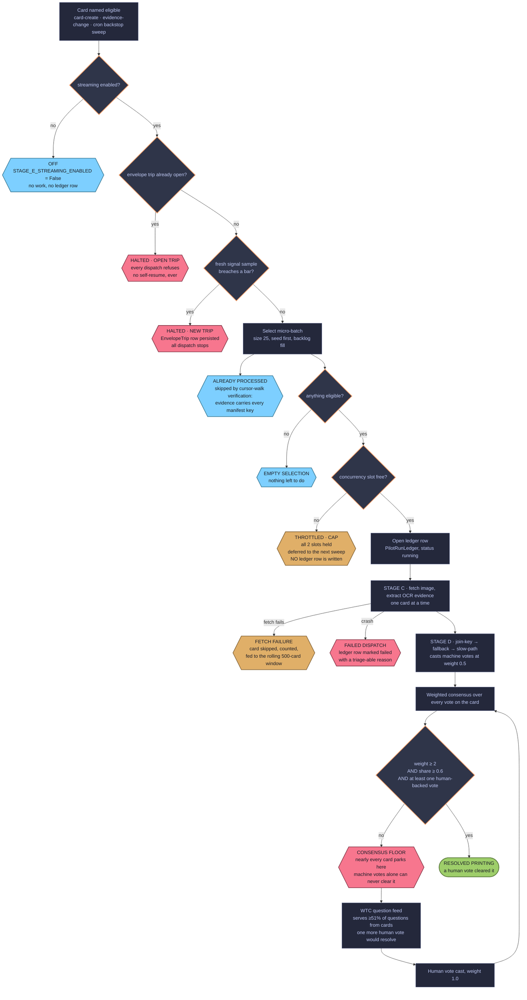

# How a card gets identified — the exact pipeline, post-#294

Plain-language companion to [`theory.md`](theory.md) — that file _proves_
the false-accept bound and soundness properties; this one _explains_ the
pipeline as the code actually runs it today, for a reader who wants the
walkthrough rather than the formal composition. See
[`theory.md`§7](theory.md#7-the-deduction-chain-as-an-explicit-composition)
for the stage-by-stage error-term treatment of the same chain, and
[`features/printing-tags.md`](features/printing-tags.md) /
[`features/catalog-completion-plan.md`](features/catalog-completion-plan.md)
for the backend and frontend this pipeline feeds into. The Stage D chain
this file walks through is currently gated on the pipeline-fidelity gate
(GitHub issue #154) before it's cleared to fire at full-catalog scale —
see [`pipeline-fidelity-gate.md`](pipeline-fidelity-gate.md) for that
gate's current status; this file describes the mechanics, not the gate.

**Reviewed and approved by the owner, 2026-07-21.** Written for the
pre-197k review.

## FIG-1 — Pipeline flow, where a card can stop



Shape carries the meaning first: a hexagon is an interception (the card
stops here); a diamond is a gate being evaluated; a plain rectangle is
work actually happening; a stadium is a terminal outcome. Colour then
grades _why_ a hexagon stopped — red is a **hard halt** (a human must
act), amber is a **soft defer** (the system retries by itself on its
own), blue is a **correct exclusion** (nothing is wrong, the card just
doesn't need this pass). Every `classDef` sets both `fill:` and `color:`
so the diagram reads correctly under either a light or a dark GitHub/wiki
theme.

**Reading it:** eight of the nine interceptions are cheap and local. The
ninth — CONSENSUS FLOOR — is where the overwhelming majority of the
catalog sits by volume, and it is the only one that is not a fault. It is
the soundness property: no volume of machine votes resolves a printing,
so the pipeline's throughput is bounded by human attention on purpose.
The loop back through the WTC question feed is the actual design claim —
machines narrow the candidate set, humans close it. **Deliberately no
absolute counts in this diagram** (owner ruling, 2026-07-25, same
"shape for now, numbers once traffic starts the confirmations" posture as
FIG-2 below) — see
[`pipeline-fidelity-gate.md`](pipeline-fidelity-gate.md), the single
source of truth for gate status, for how many cards are currently sitting
at each stage. Absolute counts return to this diagram once real user
confirmations start accumulating in volume.

## How to run all of it: `run_pipeline` (2026-07-30)

Everything below this heading used to be run **one command at a time**, in an
order carried in an operator's head. `manage.py run_pipeline` is that order,
executed:

```
Stage 0   Scryfall reference refresh, once, at the front
Stage E   operating-envelope preflight, then RE-SAMPLED at every stage seam
Stage C   evidence extraction (the pooled engine)
Stage D   join-key → fallback → illustration → slow-path, then the three chips
Stage C+  group vote propagation — md5 first, then phash distance-0
Stage E   fidelity gate — machine-only resolutions must be zero
end       channel_report
```

### Stage C+ — the md5 group behaves as one unit

An **md5 group** is a set of cards whose stored `Card.md5_checksum` is
identical: the same bytes, uploaded by different sources. Two things now key on
that same group, which is the whole point:

- **one fetch per group** — `evidence_transfer` copies an md5-sibling's
  evidence instead of re-fetching (this half already existed);
- **one deduction per group** — whichever member Stage D reached casts the
  verdict, and Stage C+ applies it across the rest of the group, under the
  casting calculator's own identity and with its already-voted guard intact.

Before this, the fetch half keyed on md5 and the vote half keyed on phash
distance-0, so _the set that got a fetch saved and the set that got a vote
propagated were different sets_. Byte-identical files always share a phash;
files sharing a phash are not necessarily byte-identical.

Propagation is **not** redundant with each member deducing for itself off
transferred evidence, which is worth stating because it looks like it should
be. A Stage D printing deduction is not a function of the evidence row alone:
candidates are resolved from `Card.name`, and md5-identical uploads from
different sources routinely carry different names. Members therefore reach
genuinely different conclusions — or none at all — from byte-identical
evidence.

Propagation **never overrides a member's own ineligibility**. A member that is
already resolved, already confirmed to a `canonical_card`, not a `CARD`, or
carrying a resolved `custom-art` / `non-english` tag is skipped. `custom-art` is
the catalogue declaring the image is _not_ a faithful depiction of a printing,
and a checksum must not overturn that.

**The phash distance-0 tier still runs, second, unchanged.** Issue #661 has
since landed, as PR #695 (2026-08-05) — but as a change to a **different**
mechanism than the one this paragraph originally anticipated. What shipped is
a widening of `printing_consensus.py`'s own identity group (the one
`group_printing_votes`/`resolve_printing` pool votes across at resolution
time — see [`theory.md`§4 item
3](theory.md#4-soundness-mechanisms)) to union in phash-d0 alongside md5. The
propagation tier described in **this** section is untouched by that change
and still does exactly what it always did: it propagates a _printing verdict_
under the casting calculator's own identity, not an illustration identity,
and it is still the only propagation reaching cards with no md5 at all — md5
is NULL for every `LOCAL_FILE` source by design and is never invented. The
"intended direction... phash shares an illustration" framing this paragraph
used to describe as issue #661's own future is **not** what #661 shipped as;
an illustration-grain propagation tier for Stage C+, if built, remains future
work, not something PR #695 delivered (the code's own comment in
`run_pipeline.py::_propagate_cluster_votes`, "Issue #661 holds the question
of what phash grouping is FOR," is equally stale as of PR #695 and not yet
corrected). Both tiers here still call one propagation engine that takes the
grouping as a parameter, so adding that illustration-grain tier later is
still a new grouping, not a restructure.

It contains **no pipeline logic of its own**. Each stage below is reached by
importing and calling the thing that already owned it; the command is
sequencing, `run_id` threading and error handling. Everything it writes is
stamped with one `run_id`, and that `run_id` is the only thing identifying a
run's output — there is no test mode, no provisional marker and no separate
table.

Two defaults are load-bearing and are the opposite of every command it calls:

- **It writes.** A bare `manage.py run_pipeline` is a complete, working run
  that persists rows. `--dry-run` is the only thing that prevents the write,
  and a dry run still executes every stage and reports what it _would_ write.
  Every Stage D calculator and attribute-chip caster defaults to
  `dry_run=True`, so `run_pipeline` passes the flag explicitly at every seam —
  inheriting those defaults would compute a whole pass and persist nothing
  while every log line reported success.
- **It redoes everything from scratch.** A fresh `--run-id` means no prior
  run suppresses work: Stage C's resume filter is run-scoped and so is each
  calculator's own eligibility. Flags narrow; nothing is required to get a
  working run. Re-passing an earlier `--run-id` resumes that run instead.

Operational detail — flags, exit codes, what a dry run reports, and which
prior-run influences survive a fresh `run_id` — is in
[`features/stage-e-operations.md`](features/stage-e-operations.md).

## What exists before anything runs

- A **Card row**: name, source drive, and a content phash of the image.
- The **reference set**: every real printing of every card name (CanonicalCard /
  CanonicalExpansion, from Scryfall) — set code, collector number, denominator.
  Refreshed by **Stage 0**, at the front of a `run_pipeline` pass and never
  during one: Stage D's illustration deduction builds its matching index from
  exactly the table a refresh rewrites, so refreshing mid-pass would have early
  and late cards deduced against different reference sets under one `run_id`.
- **No pixels stored, ever.** Images are fetched transiently, read, discarded.

## Stage C — evidence extraction (`run_image_evidence_cohort`)

1. **Fetch** the image from its source drive (transient, throttled).
2. **Crop** fixed regions: the collector line, the legal-line band (bottom
   ~10% of the card), the set-symbol area; compute geometry/quality signals
   (border color class, bleed class, blur, entropy, truncation).
3. **OCR, tiered**: a fast first pass; preprocessing fallback tiers
   (contrast/upscale/alternate modes) fire only when useful. NEW (#294): if
   the first pass reads text with **no digit-bearing structure**, escalation is
   skipped entirely — measured 99.7% of such cards never yield a collector line
   at any tier (customs). A `short_circuited` counter logs every skip so the
   197k run itself validates this. Escape hatch: `--no-shortcircuit`. **Set-code
   lexicon gate on acceptance (2026-07-23, issue #370):** a tier's parse only
   terminates escalation if its set code is a REAL `CanonicalExpansion` code (or
   the pre-M15 collector-number-only case, no set code parsed at all) — a live
   structural finding (issue #370) traced 94% of a lexicon-invalid-no-match
   sample to the OLD "any parse" criterion accepting tier 1's own OCR noise
   before tiers 2/3 ever got a chance to run. A `collector_number`-bearing parse
   whose set code ISN'T a real one no longer stops the loop; it's kept as the
   running best invalid candidate (first such parse, by tier order) while
   escalation continues, and only becomes the stored outcome if no later tier
   ever produces a lexicon-valid parse — the exact value pre-gate code already
   stored for that case, so this only changes the PATH there, never the result.
   Governs acceptance during escalation, not whether escalation starts (the
   digit-free short-circuit above is unaffected). The live-pilot OCR engine
   (`local_identify_printing_tags.run_ocr_for_card`) applies the same lexicon
   check at its own "parsed-but-no-match" outcome: a lexicon-invalid parse
   there abstains (`unknown-set-code`, non-rescannable) instead of casting the
   confident `is_no_match` vote it used to.
   **Collector-line artist gate on acceptance (2026-07-29):** the second half of
   the same criterion, for the failure the set-code axis structurally cannot see
   — a MISREAD NUMBER paired with a correctly-read set code. The collector line
   also prints the ARTIST, and `cardpicker.collector_line_artist` recovers it
   from the already-OCR'd text (no extra crop, no extra tesseract call; tolerant
   of the right-edge truncation and glyph noise that crop produces). If the
   printing a tier's own (set, number) resolves to has an artist INCOMPATIBLE
   with the artist that same tier's own text prints, the parse contradicts its
   own source string, and escalation CONTINUES rather than stopping there —
   later tiers frequently produce an internally-consistent read. Fallback
   precedence if none ever does: first artist-contradicted parse, then first
   lexicon-invalid parse, then the "no-text" artifact. Measured read-only over
   6,000 production rows: 49.5% yield a confident artist reading, and 10.7% of
   those contradict. Off unless the caller threads a lexicon + resolver
   (`stage_e_dispatch._run_stage_c` does, built once per batch).
   The same recovery also fills `ImageEvidence.artist_ocr_name` when the
   "Illus." anchor found nothing — blank on 93.7% of production rows, since that
   anchor is an old-border convention modern frames don't use. Only ever a
   verbatim `CanonicalArtist.name`, and only when exactly one canonical artist
   fits the reading (fuzzy matching yes, fuzzy storage no).
4. **Parse**: set code + collector number from the collector line
   (slash-format-aware since #260); the legal band is scanned for proxy
   marking — `not for sale`, `proxy/proxies/proxied`, `playtest` variants
   (#280/#285) — setting `legal_line_proxy_marker_detected`.
5. **Persist one ImageEvidence row**: raw OCR text, parses, phashes, classes,
   the marker flag. Keyed (card, content hash) — computed once, overwritten
   only by explicit re-extraction. Signals only; nothing that can rebuild the
   image.

**Blur variance: human-rated, not automated.** `blur_variance` (Laplacian-kernel
edge-response variance) is computed and stored in ImageEvidence but drives no
automated threshold or pipeline decision. It stays as a signal for human raters
judging upload quality. Human votes are more reliable for image quality
assessment than any single automated metric, so no threshold calibration is
planned until real rater data justifies one.

**Canvas padding: measured, not yet corrected.** Every fixed-fraction crop box
Stage C computes (the collector line, artist credit, art region, set-symbol
strip, legal line) is a fraction of the WHOLE fetched image. Some uploads place
the card on a larger canvas, leaving a band of flat colour around it — on such
an upload every one of those boxes lands inside the padding band rather than on
the card, since none of them account for it. Measured over 348 padded cards,
the collector-line crop misses the collector line entirely on 72.1% of them and
achieves adequate overlap on none; the median displacement is 8.0% of image
height. `local_canvas_padding.detect_canvas_padding` scans inward from each of
the four edges, along several sample lines per edge, for the first sustained
colour departure from that edge's own colour, and stores the result on
`ImageEvidence` (four per-edge padding fractions, four per-edge calls, one
whole-image verdict) — it does not change what any of the five boxes above crop.
A later change is what will consume these fields; until then they are dormant.

Two guards keep the measurement honest:

- **The uniformity gate.** A colour departure only counts as the canvas/card
  boundary if the zone between the image's own edge and that departure is
  itself internally uniform. Without this, a scan walking inward through a
  borderless card's own artwork would report the first colour change IN THE
  ART as though it were a canvas boundary — the difference between measuring
  padding and measuring the picture.
- **Black-on-black abstention.** When no colour departure is found within the
  search window AND the edge's own colour is itself near-black, that edge is
  recorded as INDETERMINATE, never as zero padding — a black canvas around a
  black-bordered card produces no colour departure a scan can see at all. On
  the validation sample, 4 of 352 otherwise-padded rows had exactly this
  failure on their top edge; defaulting an indeterminate edge to zero would
  under-crop those cards by the full padding band width.

A card's whole-image verdict is `padded`, `not_padded`, `ambiguous`, or
`abstain_black` (3 or more indeterminate edges). What this detector does NOT
do: it never remaps or corrects a crop box itself, and it cannot see a black
canvas behind a black-bordered card — that case abstains, it does not read as
unpadded.

## Stage D — the join-key calculator (`local_calculate_verdicts`)

Eligible cards: current evidence exists, no prior vote from this machine
identity, and (safety) nothing already resolved. Then five stages per card:

- **g1 — read the stored parse.** No re-OCR, no re-parse; Stage C's fields are
  the input.
- **g2 — candidate constraint.** Candidates are only the real printings **of
  this card's name**. The parsed (set, number) must match: exactly one
  candidate → match; none → _parsed-but-no-match_; no usable parse →
  _no-text_ skip; several → _ambiguous_. **Set-code lexicon gate (2026-07-23):**
  a `parsed-but-no-match` outcome only casts the confident no-match
  vote below when the parsed set code is a REAL `CanonicalExpansion` code —
  a live audit found 85.5% of this outcome's parsed set codes matched no
  real expansion at all (dominated by proxy/watermark text the collector-line
  crop also caught: "proxy", "mtg", "not", "card"), un-parsed noise, not
  validated evidence. A lexicon-invalid parse abstains instead (a named,
  non-rescannable skip, routed to the slow path below exactly like
  `no-text`) - no confidence/
  OCR-quality split was separable (checked directly: in-lexicon and
  out-of-lexicon parses have near-identical tesseract confidence
  distributions), so this is gated on lexicon membership alone; a
  genuinely-custom set code on a proxy of a non-existent printing is also
  abstained by this gate, a deliberate, documented tradeoff (see
  `local_calculate_verdicts.py`'s own module docstring for the full
  reasoning and numbers).
- **g3 — tie-break.** Ambiguity only: compare the set-symbol phash against
  each candidate's rendered symbol; accept only within distance threshold AND
  a margin over the runner-up; a near-tie stays unresolved. (Fired for 2 of
  20,677 cards — the tie-break is almost never needed.)
- **g4 — agreement checks.** Cross-checks that can only _narrow or withhold_,
  never manufacture a match: border-color contradiction → withhold;
  frame-style contradiction → withhold; copyright year predating the matched
  set by >2 years → withhold; artist-OCR disagreement → match proceeds at
  lowered confidence. **Collector-line artist veto (2026-07-29):** this
  calculator parses set+number out of `collector_line_raw_text` and used to
  DISCARD the artist printed in that same string. It no longer does — when the
  artist recovered from that string is incompatible with the artist of the
  printing the parse resolves to, the parse contradicts its own source (the
  signature of a misread collector number, right set code and wrong digits), so
  it abstains (`artist-mismatch`, non-rescannable, routed to the slow path like
  every other named skip) instead of casting a vote the card's own pixels
  contradict. Harsher than the artist-OCR check above on purpose: that one
  compares two readings of DIFFERENT crops, either of which could be the wrong
  one; this one is an internal inconsistency inside a single string. A
  truncated reading compatible with several real artists only abstains when it
  fits none of them. **Proxy marking is identification-neutral** (#294):
  catalog-required on every genuine upload, so presence proves nothing about
  which printing this is. (Until the #294 re-scan it wrongly vetoed 1,552
  validated matches — the re-scan un-blocks them.)

  **A check whose extractor never ran does not run (2026-07-30).** The
  calculator's eligibility query only guarantees `collector_line_ocr`, and it
  then reads six extractors' fields. Most degrade _permissively_ when their
  extractor is absent — a blank legal line is "nothing to compare", a null
  truncation flag is "not truncated" — and permissive is recoverable, because
  the human-backed gate below still stands in the way.

  The frame check was the exception, and it is now gated on `artist_ocr`.
  `illus_anchor_fired` is nullable, so `bool(None)` reads as "the anchor did
  not fire" — indistinguishable from "the extractor never looked". On a card
  with no collector number either, the classifier then answers `modern` about
  a card it has no anchor evidence for, and a genuine old-frame printing is
  withheld as `frame-mismatch`. That reason is deliberately **not**
  rescannable, so the wrong conclusion is _permanent_ for that content hash:
  no later pass can revisit it. A wrong answer nothing can revisit is worse
  than a missing one, so an absent `artist_ocr` now skips the check and leaves
  the match standing — the same "missing data is not evidence" rule the
  copyright-year check already follows. Skipping the _check_ is not skipping
  the _card_.

  The requirement is declared per-check, not per-calculator: the join-key
  deduction itself needs only the collector line, and one calculator-wide gate
  would drop cards that have everything their own decision requires.

- **g5 — the vote, never the verdict.** A match casts one machine
  CardPrintingTag vote: weight 0.5, with an ordinal confidence label
  (0.85/0.75/0.65 — a pipeline-state rank, _not_ a probability, and verified
  to have zero effect on resolution). Resolution requires total weight ≥ 2
  **including at least one human-backed vote** — structurally, the machine can
  never resolve a card alone (verified 0 machine-only resolutions across
  12,684 gate-checked cards, spanning both the printing- and tag-consensus
  engines — see `docs/reports/2026-07-21-recovery-arc.md`). Confident
  no-matches cast a no-match vote under the same rules. **Sharpened by the
  owner-ratified 2026-07-22 vote-weight scenario matrix** (implemented in
  PR #325; raw ruling at [`reference/vote-weight-matrix.md`](reference/vote-weight-matrix.md)):
  it's no longer just "a human vote must be present" — machine weight (and
  two other non-human-backed classes added the same day: a low-weight,
  hard-capped `IMPLICIT` vote cast passively when someone picks a
  candidate under an active `/editor` filter chip, and a `FEDERATED` vote
  imported from a peer instance) is now excluded **entirely** from who
  wins and from the share math the moment there's a genuine
  human-vs-human disagreement, or the moment a human-backed winner has
  already cleared the resolution bar on its own. Practically: machine
  agreement can still help a lone human's vote resolve a previously
  undecided card (that's still allowed and intended — it's the whole
  point of the deductive backfill below), but machine or implicit
  disagreement can no longer do either of the two things it used to be
  able to do — tip an actual human-vs-human tie, or quietly flip an
  already-human-resolved card back to unresolved by diluting its share.
  That second failure mode was real and reachable at the scale this
  catalog now runs at (any 2-human-vote printing with 3+ contradicting
  machine votes), and is what the ratification specifically closed.

**Everything unresolved routes to humans**: skips and no-matches go to the
slow path — durable review-queue markers carrying the raw signals — where the
clustering backend (#265) groups them into batchable decisions, and the
question feed collects the human votes that actually resolve cards.

**Everything RESOLVED does not.** Stage D runs join-key → fallback →
illustration → slow-path in that order, and each of the three calculators
ahead of slow-path excludes the cards it confidently voted on from the review
queue. The exclusion is what makes the ordering real; without it the ordering
is decorative and slow-path routes the card anyway. Three properties are
deliberate:

- The qualifier is `is_no_match=False`. A calculator's `is_no_match` vote is
  it CONCLUDING it cannot identify the card, which is exactly a card a
  reviewer should see. Excluding those too would trade wrong human work for a
  silently emptied queue.
- A card a calculator merely SCANNED and abstained on is not excluded — it
  still has no confident automated hit from anything.
- The exclusions are **not run-scoped**. "Calculator X has a confident vote
  for this card" is a statement about the catalogue, not about a run; scoping
  it would let slow-path in run B route a card resolved in run A, undoing a
  solved card. Run-scoping applies to a calculator's own progress, never to an
  upstream verdict.

The illustration exclusion was **missing until 2026-07-30**, and the command's
own sequencing comment said so. Consequence is wrong human work, not a no-op —
a reviewer asked to identify a card the pipeline just identified. Bounded so
far only because `stage-d-illustration-v2` has never run; the read-only replay
in [`pipeline-fidelity-gate.md`](pipeline-fidelity-gate.md) projects ~3,233
printing votes, so it would have fired on the first `-v2` run.

## Parallel detectors (same evidence, never gate identification)

- **AI-art detector**: generator names in the OCR text → "AI-Generated" tag
  votes (ordinary consensus since #292). Detect-and-tag only.
- **"Marked as proxy"** (#291, planned): marker presence → tag; **absence** →
  moderation flag, batched by source (the counterfeit-risk framing).
- **Artbox-phash exemplar index** (#508 phase 1, `artbox_exemplar_backfill.py`,
  `ArtboxPhashExemplar`): a second, OCR-free illustration-deduction path,
  built but not yet wired to anything. A card's own `artbox_phash` (the
  evidence-only extractor from #480) is labelled with the `illustration_id`
  of the printing that scan was identified as, sourced two ways — a
  human-backed printing resolution (`printing_tag_status == RESOLVED`,
  always human-backed by the g5 gate above), or an unopposed join-key
  machine vote at 0.75/0.85 confidence (the artist-disagreement tier, 0.65,
  and the no-match tier, 0.6, are both excluded — a wrong exemplar
  propagates to every card it later matches). Every row records its own
  seed kind and confidence, human and machine seeds stay permanently
  distinguishable, and a bad seed retracts together with everything it
  seeded via a shared `seed_group_key` (one md5-identity-group resolution,
  or one source vote). **Never sourced from Scryfall images** — phash
  comparability needs the same crop geometry our own extractor guarantees
  and Scryfall's `art_crop` framing does not.

  **What this deliberately does NOT do, in phase 1**: it does not compare
  any unresolved card against the index, does not resolve anything, does
  not cast an illustration or printing vote, and does not touch
  `resolve_weighted_consensus` or the human-backed gate. The index exists
  and is measured; nothing reads it yet. A phase 2 matching calculator
  (comparing unresolved scans against this index at d=0/d≤2 and reusing the
  illustration→printings vote logic the design docstring in
  `ArtboxPhashExemplar` describes) is gated on the coverage this index
  actually measures once seeded, the same measurement-gate discipline
  #693 established.

## Reading a zero-row channel

**A zero-row channel is evidence we never ran it, not evidence it is
unnecessary. Nothing is culled without a positive reason.** (Ruling
closes GitHub issue #618; rehomed here so it survives that issue's
closure.)

**Corollary 1 — a zero-row IDENTITY is not a zero-row CHANNEL.** A
superseding caster writes under a NEW identity; the old identity stays
at zero forever. An audit counting by identity will report a channel
dead while its replacement carries hundreds of thousands of rows.
Observed 2026-08-05: `local-fallback-v1` reads 0 while
`frame-style-cast-v1` carries ~151,161 rows for the same conceptual
channel. Count by TAG, not by identity; enumerate every identity that
has ever written a channel's tag before concluding it is silent — never
assume one identity per channel.

**Corollary 2 — read the channel's own stated intent before calling it
defective.** Three channels read as broken in a single audit and all
three were documented, deliberate states, not defects:

- `local-fallback-v1` at zero — superseded by a purpose-built caster
  (PR #654).
- bleed-edge (`bleed-edge-cast-v1`) emitting only negative votes —
  `local_fallback.cast_bleed_edge_vote`'s own docstring records that this
  negative-only design superseded an original both-directions design on
  2026-07-15: `appropriate-bleed` is a SENSITIVE tag requiring moderator
  co-sign, and voting APPLY on the routine ~97.5% case "would flood
  moderation with confirmations of normalcy rather than surfacing the
  rare real exception, which is what a SENSITIVE tag is for." Absence of
  a vote **is** the documented convention for normal bleed.
- art-edge-continuity (`local_art_edge.classify_art_edge_continuity`)
  casting nothing — its own docstring states it is "EVIDENCE-ONLY
  today — nothing votes on it yet", gated behind
  `cast_art_edge_continuity_vote`. That validation pass against
  Scryfall's own `frame_effects` ran 2026-08-06
  (docs/reports/2026-08-06-art-edge-relative-comparison.md) after a
  retune from an absolute per-band variance test to a within-image
  colour-distance comparison against the card's own already-classified
  border (`ImageEvidence.layout_class`) — and did not clear the stated
  bar: 0 of 30 genuine Scryfall extended-art images read `extended`.
  Still evidence-only by a measured result, not merely a stated
  deferral.

**The general form — the magnitude/exception split.** Quantitative
facts live in EVIDENCE COLUMNS; votes surface only the actionable
EXCEPTION. Bleed is the worked example: `local_fallback. compute_bleed_diff_mm` runs unconditionally inside `image_evidence.py`'s
per-card field computation (`image_evidence.py:1053`) and persists a
signed per-edge measurement to `ImageEvidence.bleed_diff_mm` (column
since migration `0087_imageevidence_bleed_diff_mm`; negative =
over-bleed, positive = under-bleed), while the vote channel
(`cast_bleed_edge_vote`) tags only the exception — a confidently
`'trimmed'` reading. Anything reasoning about HOW BADLY a card bleeds
reads `bleed_diff_mm` directly, never the vote. Therefore: a channel's
row count cannot be interpreted on its own — read its
docstring/design record, and check whether a companion evidence column
already carries the magnitude, before calling a silent vote channel
broken.

This is a different claim from `channel_report.py`'s own "WHY ZERO
GATES" principle (`OPS-CORR-0008`: a channel that produces nothing must
be treated as a run failure unless declared otherwise). That rule is
about the REPORTING INSTRUMENT failing to notice a real silent channel;
this ruling is about correctly INTERPRETING a zero once the instrument
has already surfaced it.

## Why a bad identification is hard

Candidates are name-constrained (a wrong match must be a real printing _of the
same card name_ with a colliding set+number — the parse would have to be wrong
in a way that lands exactly on a sibling printing); the tie-break demands a
margin, not just a best score; every cross-check can only withhold; and no
machine vote resolves anything without a human. Measured so far: zero false
accepts observed at every gate that can be measured, with the error terms that
remain unmeasured named as such in
[`theory.md`§7](theory.md#7-the-deduction-chain-as-an-explicit-composition)
rather than assumed.

## Reversibility

Every machine action carries a run_id and identity: votes retract by
identity+card set, evidence re-extracts by run, review routings clear by
selector. Nothing the machine does is permanent against better information —
the only permanent records are what humans decide.
