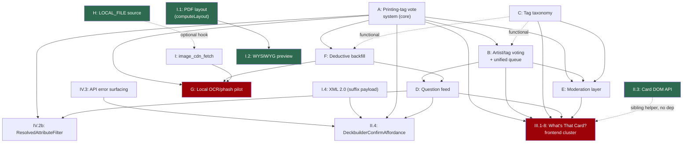

# Upstream-readiness audit

Standing structure for offering fork work back to `chilli-axe/mpc-autofill`
one self-contained chunk at a time, without ever sending an omnibus.
**This document is a survey, not an action** — nothing here has touched
upstream's repo. Phase 2 (cutting actual branches) happens only after the
owner picks specific chunks off the ladder below.

## Phase 2 status (owner decision, 2026-07-18)

Upstreaming continues at **minimal investment** — this audit satisfies
`docs/infrastructure.md`'s check-in requirement, and the frontend-direction
question (whether chilli-axe is actually dropping the Node.js frontend)
goes to the maintainer directly via a P.S. on an unrelated upcoming
message, rather than being speculated on here. Full Phase-2 scope waits
on that answer.

**One branch cut now, as pattern-proof**: `upstream-feat-local-file-source`
(Tier 1 #2 below), chosen for best survival odds if the frontend answer
turns out to matter — it's 100% backend, no frontend surface at all.
Pushed to `origin` (this fork) at commit `93874645`, cut from
`upstream/master` at `c3d10253`. Pre-commit (ruff/isort/black/mypy) green
in the extracted context; test coverage hand-verified where the sandbox's
missing Docker/Postgres/ES made the real test suite uncollectable. Draft
PR description at
[`drafts/upstream-feat-local-file-source.md`](drafts/upstream-feat-local-file-source.md).
**Not opened anywhere** — sits ready until the owner sends it.

**Card DOM API (Tier 1 #1) and the dead-image/error-states pairing
(Tier 1 #4+#5) are deferred**, not dropped — next up once the frontend
question is answered, since both are frontend chunks and their value
depends on there still being a Node.js frontend for upstream to accept
changes into.

## 0. Method and ground truth

`git diff upstream/master origin/master` (two-dot, tree-level) is the
only diff form that works here — **there is no merge-base** between the
`upstream` remote (`chilli-axe/mpc-autofill`) and this fork's `origin`
history as normally cloned, because the `drives.csv` history rewrite (see
`docs/infrastructure.md`) scrubbed a leaked-secrets range. A three-dot
diff or `A..B` commit range silently returns nonsense (or nothing) against
that gap.

**Two gotchas hit while producing this audit, both worth carrying
forward**:

- **Shallow-clone false alarm.** A shallow clone (the default for this
  session) makes the merge-base gap look *total* — `git cat-file -t` on
  every SHA in `docs/upstreaming/vote-system.md` fails, `git merge-base`
  returns nothing, and it reads exactly like the history-rewrite incident
  happened again. It didn't. `git fetch --unshallow origin` (fetching
  either remote unshallows the shared object store) restores the real
  picture: merge-base **is** `3c717d2a` (matching vote-system.md's
  2026-07-13 finding exactly), every historical SHA resolves, and
  `upstream/master` has moved exactly 2 commits past that point as of
  2026-07-18. **Any future session doing extraction work must
  `git fetch --unshallow` before trusting a "no merge-base" or "SHA not
  found" result as real** — it's much more likely to be this artifact
  than a second history-rewrite incident.
- **`upstream/master` genuinely does move.** 2 commits in 5 days
  (2026-07-13 → 2026-07-18) at the observed rate, mixed dependabot and
  human PRs. Re-verify merge-base and re-diff the target file set
  immediately before cutting or updating any extraction branch — don't
  trust a stale check.

**The one PR of ours already merged upstream**: **#467**, "Fix
`toSearchable` to not strip mid-string 'the'" (completes backend PR
#460), merged 2026-07-18 by maintainer Nicholas de Paola. Full
characterization in §6 / `conventions.md` — it's the house style every
`upstream/*` branch should match.

**Standing risk, foregrounded per `docs/infrastructure.md`**:
upstreaming is currently **deprioritized** — chilli-axe has signaled
plans to drop the Node.js frontend, which could waste further
upstreaming effort. This audit is the "checking in first" the doc asks
for; it does not override it. Nothing below should be sent without the
owner re-confirming that's still worth doing, chunk by chunk.

## 1. Full chunk decomposition

Three independent passes: backend (`MPCAutofill/`, `schemas/`), frontend
(`frontend/`), and everything else (CI, `docker/`, `image-cdn/`,
`desktop-tool/`, root config) + conventions mining. Total diff size:
`MPCAutofill/` +20,058/−439 (105 files), `schemas/` +584/−2 (44 files,
all net-new), `frontend/` +14,906/−2,594 (150 files), everything else
+6,352/−61 (38 files). Migrations `0001`–`0049` are byte-identical to
upstream; everything from `0050` on (`0050`–`0064`, 15 migrations) is
fork-only.

Legend — **Value**: (a) useful to every instance, (b) useful to forks
like us, (c) ours-only. **Risk**: extraction/entanglement risk if cut
into its own branch.

### 1.1 Backend (`MPCAutofill/`, `schemas/`)

| Chunk | What | LOC | Value | Risk | Depends on |
|---|---|---|---|---|---|
| **A. Printing-tag vote system (core)** | Weighted-consensus engine (`AbstractWeightedVote`, `VoteSource`) + `CanonicalPrintingMetadata`/`CardPrintingTag`, printing-candidate search, ES re-rank hook | ~700 (migrations `0050`–`0051`) | **(a)** | Low | none — foundation |
| **B. Artist + tag weighted voting, unified queue** | Extends A to artist/tag attributes, `2/voteQueue/` | ~1,300 (migrations `0052`–`0055`, `0057`) | **(a)** | Medium | A |
| **C. Tag taxonomy (Stage 3)** | Seeded `Tag` rows + fuzzy filename matching, `display_name` split | ~500 (migration `0056`) | **(b)** | Low | none (functional dep on B) |
| **D. Unified question feed** | `2/questionFeed/`, single prioritized review stream replacing the 3-tab switcher | ~600 | **(a)** | Medium | A, B, F |
| **E. Moderation layer** | Discord OAuth, privileged-vote co-sign gate, `CardReport`, Reports/Drives admin queue | ~1,300 (migrations `0057`–`0059`) | **(b)**, mechanism only | Medium-high | A, B, C |
| **F. Deductive printing-tag backfill** | Logic-only vote casting (D1/D2 tiers) for logically-entailed printings | ~600 | **(a)** | Low | A, C |
| **G. Local OCR/phash identification pilot** | Tesseract + perceptual-hash + fallback engines, run-cohort revocability | **~6,700** (migrations `0060`–`0064`) | **(a) with caveats** — pilot-status, fork-tuned constants | **High** | A, F, I |
| **H. `LOCAL_FILE` source type** | Real implementation of upstream's already-anticipated stub; local-disk cataloging + path-traversal-safe image serving | ~320 | **(a)** | **Low** | none — most self-contained chunk in the diff |
| **I. Image-CDN backend fetch helper** | `image_cdn_fetch.py`, server-side full-res fetch for OCR/hashing | ~77 | (c) as written | Medium | Worker/R2 infra (out of scope) |
| **J. Decklist printing-aware line formatting** | `format_decklist_line()` appends `(SET) NUM` when the import API gave printing data | ~50 (entangled in a 107-line file diff) | **(a)** | Low, but needs hunk-split | none |
| **K. Ours-only operational settings** | Sentry removal, CORS branding, Discord/session-cookie env wiring | interleaved in `settings.py` | (c) | N/A — strip, don't port | — |

Full per-chunk detail (files, tests, exact dependency chains,
entanglement notes) is in the backend research pass; the table above is
the actionable summary. One correction to the original brief: **"PDF
layout backend support" and "XML 2.0 backend support" do not exist** —
both are 100% frontend-only (confirmed: zero `xml` matches anywhere in
`MPCAutofill/`'s diff).

### 1.2 Frontend (`frontend/`)

| Chunk | What | LOC | Value | Risk | Depends on |
|---|---|---|---|---|---|
| **I.1 PDF layout extraction (`computeLayout`)** | Pure, side-effect-free page-layout math pulled out of render components | 336, both new files | **(a)** | **Very low** | none |
| **I.2 WYSIWYG page preview** | Canvas preview using I.1, no real PDF render needed | 541 + `pdfjs-dist` build step | **(a)** | Low | I.1 |
| **I.3 PDF dead-image blocking** | Blocks/warns instead of silently shipping blank cards on a failed image fetch | ~739 | **(a)** | Low | none |
| **I.4 XML 2.0 export + decklist round-trip** | Versioned, backward-compatible XML with optional printing data; `stripFoilMarker` import fix | ~360 | split (a)/(b) | Low (format/foil-fix) / Medium (suffix payload) | suffix payload needs A/D |
| **II.1 Grid-selector UX/a11y pass** | Keyboard nav, modal autofocus fix, mobile filters default | 285 | **(a)** | **Very low** | none |
| **II.2 Card image error/loading states** | "Still loading…" hint, styled error placeholder replacing a harsh black 404 PNG — the display-side of dead-link handling | 404 | **(a)** | **Very low** | none |
| **II.3 Card DOM API** | `data-card-*` attributes + `mpc:card-selected` event, additive/generic | ~300 | **(a)** | **Very low** | none — already flagged "pending upstream" in fork memory |
| **II.4 DeckbuilderConfirmAffordance** | In-context printing-confirm badge in the editor | 650 | (b) | High | IV.3, I.4, A |
| **II.5 General UI/mobile/a11y polish** | Mobile stacking, scroll-chain fix, a11y sweep | ~424 | **(a)** | Low (verify `Navbar.tsx` isolation) | none |
| **III.1–III.8 "What's That Card?" frontend** | QuestionFeed, PrintingTagPicker, attribute voting/chips, reporting, moderation UI, `/whatsthat` page | ~6,300 | (b)/(c) mixed | **High** | A, B, C, D, E |
| **III.2 questionFeed count-semantics fix** | The specifically-requested candidate — confirmed real historically (`a0e2aa08`), but **fully subsumed into III.1's current 970-line file, not separable today** | n/a now | (b)/(c), inherits III.1 | N/A — would need reconstruction from git history if pursued alone | III.1 |
| **IV.1 Google Drive "Save PDF to Drive"** | Write-scoped OAuth flow, independent of the existing read-only picker | 174 | **(a)** | **Very low** | none |
| **IV.2 Search filters** | Mature-content toggle (generic) + resolved-attribute filters (needs backend) | 511 | split (a)/(b) | Low / Medium | ResolvedAttributeFilter needs A/D |
| **IV.3 API error surfacing + toasts** | Real backend error messages + friendly 429 handling | 250 | **(a)** | Low | none |
| **IV.4 Keyrune set-icon rendering** | Real MTG expansion-symbol glyphs via icon font | ~115 | **(a)** | **Very low** | none |
| **IV.5 Print-export ordering tabs + flags** | NotMPC/PringlePrints tabs, vendored flag SVGs | 227 | **(c)** unambiguously | High (vendor content) | none |
| **IV.6 Telemetry/Sentry removal** | Deletes fork's own error-tracking opt-out | −64 | (c) | None to extract | — |
| **IV.7 Branding & site identity** | About page, logo, footer, nav copy | ~148 | (c) | N/A | — |
| **IV.8 Support-modal removal** | Deletes upstream's donate/support-developer modals | −180 | (c) | None | — |
| **IV.9 Build/tooling & test-infra** | Mostly ours-only config; one candidate: `msw`+`playwright` patch | ~110 + lockfile | mostly (c), one (a) | Low | verify upstream has same dep pair first |

### 1.3 CI / tooling / infra (everything outside `frontend/`, `MPCAutofill/`, `schemas/`)

`cloudflare-static-site/`, `github-release-reverse-proxy/`, and every
root config file (`readme.md`, `pyproject.toml`, `mypy.ini`,
`.prettierignore`, `.python-version`, `uv.lock`) are **byte-identical**
to upstream — zero drift, nothing to reconcile there. All branding lives
in `frontend/`.

| Chunk | What | Value | Risk |
|---|---|---|---|
| **`restart: unless-stopped` on all 5 compose services** | Host-reboot resilience, live-verified with a real reboot test | **(a)** | **Very low** |
| **Postgres/ES bound to `127.0.0.1` not `0.0.0.0`** | Security hardening, stops exposing DB/search ports to the internet | **(a)** | **Very low** |
| **nginx `Host`/`X-Forwarded-Proto` header fix** | Fixes nginx's `proxy_pass` defaulting `Host` to the upstream container's own name, breaking absolute-URL construction behind a reverse proxy | **(a)** (the 2-line header fix specifically) | **Very low** |
| **image-cdn full-tier rate limiter + CORS fix** | The "client-side rate pacer" from the original brief — **it's a Cloudflare Worker chunk in `image-cdn/`, not `frontend/`.** Adds real rate limiting + an intentional (not accidental) CORS header for `lh4.googleusercontent.com` full-res fetches | **(a)** | **Low** |
| **`desktop-tool` `PIL.Image` → `PILImage` `TYPE_CHECKING` rename** | Avoids an import-shadowing footgun | **(a)** | **Trivial** |
| **`.dockerignore`** | Stops uploading the whole repo (incl. gigabyte+ `node_modules`) as Docker build context | **(a)**, minus one `.claude` line | Low |
| **CI mypy numpy-pin lesson** | "An unpinned transitive dep can resolve differently in CI's mypy sandbox than local dev" — a portable insight, not a standalone diff | **(a)** as a lesson only | N/A alone |
| **`GIT_SHA` build-arg baking + staleness gate** | Detects a deployed image running stale migrations | **(b)** | Medium — split across Docker + backend |
| **`entrypoint.sh`: always migrate, drop blocking first-boot catalog bootstrap** | Real behavior change — a fresh instance no longer auto-populates on first boot | **(b)** | Medium-high, must be opt-in not a silent default flip |
| GA/Sentry removal from CI, GH Pages deploy pipeline, `docker-compose.prod.yml` env branding, `test-backend` dropped from `build-frontend`'s needs | Fork hosting/telemetry choices | **(c)** | N/A |

## 2. Dependency graph

Roots with **zero** dependency on any other fork-only code (green in the
graph): Card DOM API (II.3), `LOCAL_FILE` source (H), PDF layout
extraction (I.1), PDF dead-image blocking (I.3), grid-selector pass
(II.1), card image error states (II.2), Google Drive Save-to-Drive
(IV.1), Keyrune icons (IV.4), all the CI/tooling one-liners. These are
the ones a maintainer can review with zero context on the rest of the
fork.

Chunk A is the true foundation of everything "What's That Card?"-shaped
(B through G, III.1–8 all trace back to it) — proposing it is the
highest-leverage single move if the vote system is ever pitched at all,
but it's also the biggest single non-trivial-review-size chunk in that
family (~700 LOC plus the search/ES hooks it wires into).

## 3. The ladder

Ranked by (upstream value × extraction ease). Tier 1 chunks need no
other fork-only code, have no fork branding, and are small enough to
review as one PR each — these are what Phase 2 should draw from.

### Tier 1 — ready now, near-zero prep

1. **Card DOM API** (frontend II.3) — additive, generic, zero deps,
   already informally flagged as "pending upstream" in this fork's own
   working notes before this audit even started.
2. **`LOCAL_FILE` source type** (backend H) — completes a stub upstream's
   own schema/enum already anticipated; the most self-contained chunk in
   the whole diff; 17 tests need no network/credentials.
3. **PDF layout extraction / `computeLayout`** (frontend I.1) — pure
   refactor-for-testability, two new files, nothing else touched.
4. **Card image error/loading states** (frontend II.2) — the display
   half of dead-link handling; replaces a harsh black 404 PNG with a
   real placeholder + slow-load hint.
5. **PDF dead-image blocking** (frontend I.3) — a real silent-data-loss
   bug fix (blank cards shipped to a print vendor with no warning);
   strong "why this matters" story for a reviewer.
6. **Grid-selector UX/a11y pass** (frontend II.1) — keyboard nav +
   autofocus + mobile-default fixes, all correctness bugs.
7. **Google Drive "Save PDF to Drive"** (frontend IV.1) — a generically
   valuable capability extension to a feature upstream already has.
8. **Keyrune set-icon rendering** (frontend IV.4) — real MTG set-symbol
   glyphs, zero fork data shape required.
9. **`stripFoilMarker` decklist-import fix** (embedded in frontend I.4,
   needs extracting from the larger XML-2.0 commit) — tiny, generic bug
   fix for foiled-card collector-number parsing.
10. **Docker/infra one-liners**: `restart: unless-stopped`, Postgres/ES
    bound to `127.0.0.1`, the nginx `Host`/`X-Forwarded-Proto` fix,
    `desktop-tool`'s `PIL.Image` rename. All trivial, all universal.
11. **image-cdn full-tier rate limiter** (the actual "rate pacer" — it's
    in `image-cdn/`, not `frontend/`, correcting the original brief) —
    self-contained Worker module + 6 tests, fixes an accidental (not
    intentional) CORS pass-through as a side effect.

### Tier 2 — real value, moderate prep

- **WYSIWYG PDF preview** (I.2) — needs its `pdfjs-dist`/postinstall
  build step to travel with it.
- **API error surfacing + friendly 429 toasts** (IV.3).
- **General UI/mobile/a11y polish** (II.5) — isolate `Navbar.tsx`'s
  branding lines first.
- **`.dockerignore`** — strip the one `.claude` reference.
- **Decklist printing-aware line formatting** (backend J) — clean
  content, needs hand-splitting out of a file that also carries two
  unrelated changes.
- **Mature-content filter toggle only** (IV.2, not the resolved-attribute
  half) — pure UI surfacing of an existing setting.
- **`msw`+`playwright` patch** (IV.9) — verify upstream's `package.json`
  actually has the same dependency pair before proposing.
- **XML 2.0 format mechanism**, minus the canonical-printing-suffix
  payload (I.4 partial) — versioned/backward-compatible export format on
  its own merits.

### Tier 3 — high value, needs a real feature-sized pitch

- **Printing-tag vote system**: Chunk A (+ optionally B, D) — the
  single most upstream-pitchable *big* idea in this fork (community
  disambiguation of which Scryfall printing a catalog image depicts),
  but it's feature-sized, not quick-win-shaped, and its frontend half
  (Cluster III) is ~6,300 LOC that doesn't work without it. This is
  `docs/upstreaming/vote-system.md`'s territory — see §5 below for that
  doc's current accuracy.
- **Moderation layer** (E) — the *mechanism* (privileged-vote co-sign,
  pluggable moderator grant) generalizes; the Discord-specific wiring
  doesn't, and would need reframing as provider-agnostic OAuth first.
- **`GIT_SHA` build-arg + staleness gate** (CI + backend) — needs the
  Docker and backend halves coordinated in one pitch.
- **`entrypoint.sh` migrate-always change** — a real behavior change
  (drops first-boot auto-catalog-population); must be pitched as opt-in,
  not a silent default flip, or it breaks upstream's documented
  quick-start experience.

### Tier 4 — not upstream-pitchable (ours-only, catalog and skip)

Branding (About page, logo, footer, nav copy), Discord OAuth specifics,
PringlePrints/NotMPC ordering tabs (vendor-specific business content),
Sentry/GA telemetry removal, support-modal removal, the GitHub Pages
deploy pipeline, `docker-compose.prod.yml` env/branding additions,
`CORS_ALLOWED_ORIGINS` swap, dropping `test-backend` from CI (fork is
missing upstream's secrets, not a bug).

### Tier 5 — too large/risky for any near-term PR

**Local OCR/phash identification pilot** (backend G, ~6,700 lines). Real
and reusable in mechanism (never-resolve-alone gate, checkpointing,
run-cohort revocability via `PilotRunLedger`), but explicitly
pilot-status: ~12.8-day single-process full-catalog runtime, tuning
constants (fetch DPI, crop boxes, phash thresholds) empirically derived
from this fork's own small sample images, a `RunPython` data migration
splitting production vote data (`0060`), and the heaviest shared-file
entanglement of any chunk. Would need splitting into several
independently-reviewable PRs (OCR engine / phash engine / fallback
engine / orchestration) and a re-validation pass against a different
catalog's images before it's honestly presentable — not a Phase-2
candidate.

## 4. Candidates from the original brief — verified, corrected, or dropped

- **questionFeed count semantics** — real (fixed `a0e2aa08`, backend
  `get_remaining_estimate()`/`QuestionFeedCounts`), but **not separable
  in the current tree**: fully absorbed into `QuestionFeed.tsx`'s current
  970-line state. Demoted off the ladder; would need reconstruction from
  git history if pursued as a standalone fix, and only makes sense
  bundled with a Chunk D pitch anyway (question feed doesn't exist
  upstream to patch).
- **CI/tooling hygiene fixes** — confirmed, several genuinely good ones
  found beyond what the brief named (restart policy, port binding, nginx
  header fix, `PIL.Image` rename, `.dockerignore`, the mypy-numpy-pin
  lesson).
- **Dead-link handling** — confirmed real and split cleanly into a
  frontend display half (II.2) and a PDF-export half (I.3), both Tier 1.
- **PDF layout extraction (`computeLayout`)** — confirmed, Tier 1.
- **Client-side rate pacer** — **does not exist in `frontend/`**; the
  actual feature is the image-cdn Worker's rate limiter (`image-cdn/`,
  Cloudflare Workers code, not the Next.js app). Real and Tier 1, just
  mis-scoped in the original ask.
- **XML 2.0 (+ import round-trip)** — confirmed, real, splits into a
  generic format mechanism (Tier 2) and a fork-dependent payload
  (bundled with the vote system, Tier 3).
- **Not previously on the ladder, found here**: Card DOM API, `LOCAL_FILE`
  source type, Google Drive Save-to-Drive, Keyrune set-icon rendering,
  the Docker/nginx one-liners, and `stripFoilMarker` — several of these
  (Card DOM API, `LOCAL_FILE`) are arguably stronger candidates than
  anything on the original list.

## 5. `docs/upstreaming/vote-system.md` — currency check

Verified independently against current `origin/master`: **accurate for
what it says it covers** (the ordered commit list, the
`PrintingTagQueue.tsx`/`printingQueue.tsx` starburst-entanglement
warning, the fork-content check) but **materially incomplete** as "the
vote system" now means on current `master` — it predates:

- **Chunk E (moderation layer)** entirely (migrations `0057`–`0059`
  postdate its last-covered migration, `0055`).
- **Chunk D (question feed)** — the doc still describes `2/voteQueue/`
  (Chunk B) as the redesign's endpoint; `2/questionFeed/` has since
  superseded it as the primary review surface.
- **Chunks F and G** (~7,300 combined lines: deductive backfill + the
  local OCR/phash pilot) — not mentioned at all.
- Its own §5 re-verification command (`git merge-base upstream/master
  origin/master` should show 0 commits ahead) needs the two-dot-diff
  method substituted for the range-diff it suggests, and the
  shallow-clone caveat from §0 above applied before trusting the result.
- Its specific cherry-pick recipe for `PrintingTagQueue.tsx` now targets
  a **file that no longer exists** — that logic was redistributed into
  `cardPanel.tsx`/`whatsthat.tsx`/`QuestionFeed.tsx` during the queue
  redesign. The doc's *warning* (don't cherry-pick that file's history
  commit-by-commit) is still directionally correct; its *recipe* needs
  redoing against the new files if ever acted on.

Recommendation: keep the doc as-is for the slice it accurately covers
(Chunks A/B), but add a header note pointing here for anything past
2026-07-13, so a future reader doesn't assume it's the complete picture.

## 6. Conventions

Full write-up in `docs/upstreaming/conventions.md`. Headline findings:

- PR #467 (ours, merged) is one commit, plain imperative title,
  root-cause explanation + concrete before/after example in the body,
  references the completed companion PR (#460) by number, updates its
  test in the same commit. No conventional-commits prefix. This is the
  template to match.
- Upstream has **no squash-merge policy** and **no enforced commit
  prefix** — PR size is highly variable (2-file fixes to 3,000+-line
  overhauls), but every sampled PR (13 non-dependabot merges inspected)
  shipped test-file changes alongside the behavior change. None shipped
  without tests.
- PR bodies are hand-written, not AI-generated, per the maintainer's
  explicit ask across all 5 of this fork's upstream PRs so far — the
  `Co-Authored-By: Claude Sonnet 5` **commit trailer** is the accepted
  AI-assistance disclosure, not PR body text.
- Full-stack features are commonly split into sibling backend/frontend
  PRs (e.g. #441/#442, merged ~3 hours apart) rather than one combined
  PR — worth replicating for any full-stack fork feature.
- Tool/hook **versions** in `.pre-commit-config.yaml` are already
  identical between fork and upstream — no reconciliation needed there.
  The only drift is the mypy hook's `additional_dependencies` pin list,
  which should carry only the pins a given extraction branch's own
  feature needs, and must **not** silently drop `sentry-sdk` unless the
  same PR is also proposing to remove upstream's own telemetry.

## 7. Branch architecture proposal

**Tracking**: keep the existing `upstream` remote
(`https://github.com/chilli-axe/mpc-autofill.git`), fetched on demand
(`git fetch upstream master`) rather than on a fixed schedule — chunks
sit ready-and-waiting until the owner personally sends one, so there's
no value in syncing more often than "right before cutting or updating a
branch." Optionally mirror it as a local `upstream-master` branch
(`git branch -f upstream-master upstream/master` after each fetch) purely
for discoverability in `git branch`/`git log --graph` output; not load-bearing.

**Per-chunk branches**: this fork already has a naming convention in
active use — `upstream-fix-frontend-searchable-the`,
`upstream-fix-image-cdn-cors`, `upstream-fix-pdf-canvas-preview`,
`upstream-fix-pdf-eager-wasm-load`, `upstream-fix-pdf-thumbnail-worker-route`
all exist as branches on `origin` today. Extend it rather than replace
it: `upstream-fix-<slug>` for bug fixes (as now), `upstream-feat-<slug>`
for net-new capability chunks (e.g. `upstream-feat-local-file-source`,
`upstream-feat-card-dom-api`, `upstream-feat-save-pdf-to-drive`).

**Cutting a branch**: per `docs/infrastructure.md`'s existing workflow —
a separate `git worktree add <path> upstream/master -b <branch>`, never
a plain checkout in the main tree (keeps the fork's 40+ fork-specific
commits from ever being reachable in the same working copy as upstream
history). Cherry-pick the specific commit(s) when the original message
ports cleanly; hand-reapply against upstream's current tree when it
doesn't (references "our fork"/"our master", etc. — exactly the #467
precedent).

**Before every push**, not just the first cut: `git fetch upstream
master`, re-run `git merge-base upstream/master origin/master`
(unshallow first if needed — §0), `git diff upstream/master <branch>` to
confirm the branch contains nothing but the intended change, rebase onto
the new tip if it moved, re-run `pre-commit run --all-files` plus
whichever upstream test suite(s) the change touches.

**Maintenance cost**: observed drift is low-frequency for
human-authored, review-relevant changes — 2 commits in the 5 days
between vote-system.md's last check and this one, and upstream's own
recent-PR sample skews heavily toward dependabot bumps that rarely
touch the same files a fork extraction would. Realistic cadence: check
immediately before cutting a new branch, and again immediately before
opening/updating a PR for one already cut — not a standing sync job.

## 8. What Phase 2 drew from — decided, see top of doc

Superseded by the owner's actual 2026-07-18 decision, recorded at the top
of this document ("Phase 2 status"): one branch cut
(`upstream-feat-local-file-source`), Card DOM API and the dead-image/
error-states pairing deferred pending the maintainer's frontend-direction
answer. The original pre-decision reasoning (`LOCAL_FILE` source's
zero-dependency, backend-only shape gave it the best survival odds
regardless of how that answer lands) is preserved here since it's why
that specific chunk was picked first among Tier 1's near-equally-ready
options.
